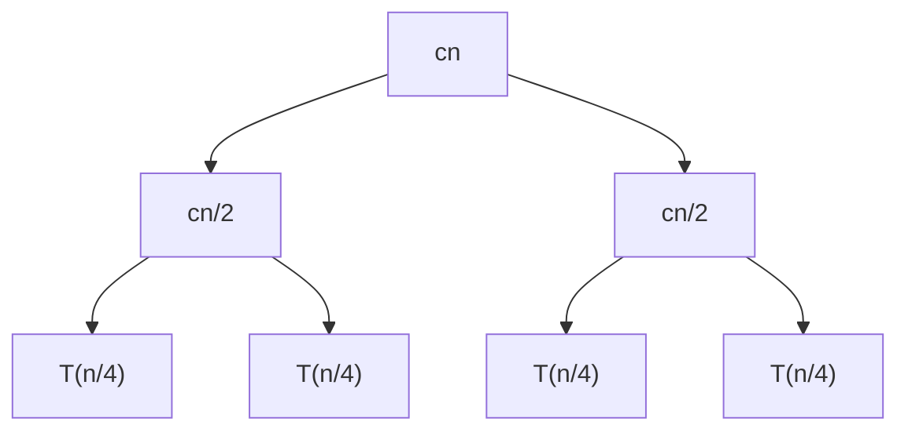
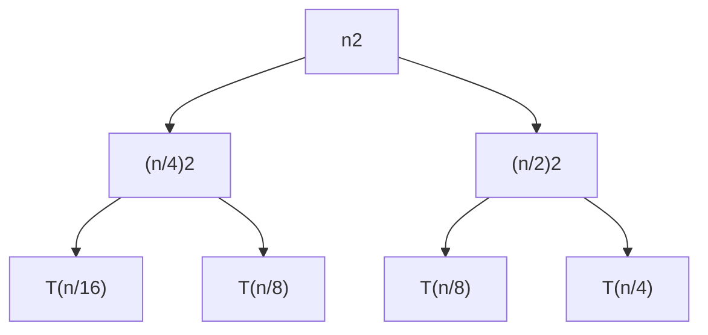

# 第一章 算法分析

## 1.1 引论

### 1.1.1 简单的排序问题

输入：一组顺序数列 $(a_{1}, a_{2}, ..., a_{n})$  
输出：按照大小顺序重新排列后的有序数列 $(a_{1}', a_{2}', ..., a_{n}')$

```c
// 插入排序
InsertionSort(A, n)
for j=2 to n
    do key = A[j]
        i = j-1
        while i>0 and A[i]>key
            do A[i+1] = A[i]
            i = i-1
        A[i+1] = key
```

最好情况：完全顺序
最坏情况：完全逆序

我们通常关注最坏情况下的运行时间，记 $T(n)$为在输入规模 $n$ 之下的最长的时间消耗。  
有时也会关注平均状态下运行时间，即期望值，记 $T(n)$为在输入规模 $n$ 之下的平均时间消耗，即时间消耗期望值。

`时间期望 = 基于输入分布情况的运行时间的加权平均`

最好情况下的运行时间是假象，只有特异性输入才会有这种结果，我们完全不考虑，猴子排序的最好情况是常数级

### 1.1.2 究竟如何描述算法的效率？

首先我们分析一段程序所需要的运行时间与什么因素有关。显然，在配置不同的两台计算机上，
同样的程序在配置更好的计算机上运行的速度更快。另外，当输入规模 $n$ 越大时，时间也会一起增长。
对于不同的编译软件或者语言，同样的算法编译后得到的机器码也大相径庭，进而影响了程序运行速度。

当输入规模 $n$ 接近无穷大时，加上任何有限的外部因素，优良的算法的效率总是比差劲的算法的效率高。

`我们真正感兴趣的是算法随着输入规模增长的增长。`

### 1.1.3 一个数学记号

$\Theta$记号：对于一个公式，舍去低阶项，并忽略常数因子

$e.g.$

$$3n^3+90n^2-5n+6046=\Theta(n^3)$$

当$n$趋近于无穷时，$\Theta(n^2)$总是比$\Theta(n^3)$更快

分析**插入排序的时间复杂度**

`算术级数`

$$T(n)=\sum_{j=2}^{n}\Theta(j)=\Theta(n^2)$$

### 1.1.4 另一种排序方法

归并排序，$A[1...n]$

1. 如果 $n=1$，排序结束  
2. 将序列分割为 $A[1...\left\lceil\frac{n}{2}\right\rceil]$ 和 $A[\left\lceil\frac{n}{2}\right\rceil+1...n]$ 并分别归并排序  
3. 合并两个分割的序列

记整个归并排序时间复杂度为T(n)
对于步骤一，只需判断1次，时间复杂度是常数级的 $\Theta(1)$
对于步骤二，它总是分成2次输入规模为 $n/2$ 的归并排序，因此时间复杂度为 $2T(n/2)$
对于步骤三，合并两个有序表的时间复杂度为 $\Theta(n)$

则针对归并排序的时间复杂度可列出方程

=\left\\{\begin{array}{l}\Theta(1)\\\\2T(n/2)+\Theta(n)\end{array}\right.)

其中，$\Theta(n)$是线性的，与 $cn$等价。另外，递归的终止计算与整个过程的时间复杂度没有任何关系。因此，公式可简化为

$$T(n)=2T(n/2)+cn$$

我们对这个递归方程进行树状展开



如上，$T(n)$可以不断这样分割下去直到递归终结，而 $T(n)$等于整个树所有节点的值的和。

除了最后一级，树的每一级的和都为$cn$，最后一级的和为$\Theta(n)$，树的层数为 $1+\log n$，高度为 $\log n$。因此最终结果为

$$T(n)=cn\log n+\Theta(n)=\Theta(n\log n)$$

## 1.2 渐进符号及递归计算

### 1.2.1 渐进符号的定义

#### $O$ 记号

1. $f(n)=O(g(n))\Leftrightarrow\exists(c>0,n_{0}>0),\forall n\geqslant n_{0},0\leqslant f(n)\leqslant cg(n)$
2. $O$ 关系是非对称的，相当于 $\leqslant$ 关系
3. $O$ 关系是一个集合，$f(n)=O(g(n))$ 实际意义是 $f(n)\in O(g(n))$
4. $O$ 关系渐近地给出 $f(n)$ 的上界

#### $\Omega$ 记号

1. $f(n)=\Omega(g(n))\Leftrightarrow\exists(c>0,n_{0}>0),\forall n\geqslant n_{0},0\leqslant cg(n)\leqslant f(n)$
2. $\Omega$ 关系是非对称的，相当于 $\geqslant$ 关系
3. $\Omega$ 关系是一个集合，$f(n)=\Omega(g(n))$ 实际意义是 $f(n)\in\Omega(g(n))$
4. $\Omega$ 关系渐近地给出 $f(n)$ 的下界

#### $\Theta$ 记号

1. $f(n)=\Theta(g(n))\Leftrightarrow\exists(c_{2}>c_{1}>0,n_{0}>0),\forall n\geqslant n_{0},0\leqslant c_{1}g(n)\leqslant f(n)\leqslant c_{2}g(n)$
2. $\Theta$ 关系是对称的，相当于 $=$ 关系
3. $\Theta$ 关系是一个集合，$f(n)=\Theta(g(n))$ 实际意义是 $f(n)\in\Theta(g(n))$，$\Theta$ 是 $O$ 和 $\Omega$ 的交集
4. $\Theta$ 关系渐近地给出 $f(n)$ 的确界

### 1.2.2 递归计算

#### 代换法

1. 猜测最高项；
2. 化为线性形式；
3. 数学归纳法证明。

---

$e.g.$

$$T(n)=4T(n/2)+n$$

**假设** $$T(n)=O(n^3)$$

`大O记号不能用于数学归纳，首先要化为线性形式`

下面证明 $$T(n)\leqslant cn^3$$

假设不等式成立，则有 $$T(n)=4T(n/2)+n\leqslant4c(n/2)^3+n$$

即 $$T(n)\leqslant \frac{cn^3}{2}+n$$

$$T(n)\leqslant cn^3-(\frac{cn^3}{2}-n)$$

其中，$$\forall (c\geqslant2,n\geqslant1),\frac{cn^3}{2}-n\geqslant0$$

因此此时，$$T(n)\leqslant cn^3$$

假设成立

**因此**，$T(n)=O(n^3)$ **成立**

---

虽然但是，$O(n^3)$ 并不是该递归式中 $T(n)$ 的上确界，严格结果为 $O(n^2)$，下面给出证明

同样地，**假设** $$T(n)=O(n^2)$$

下面证明 $$T(n)\leqslant c_{1}n^2-c_{2}n$$

假设不等式成立，则 $$T(n)\leqslant4c_{1}(n/2)^2-4c_{2}(n/2)+n$$

即 $$T(n)\leqslant c_{1}n^2-2c_{2}n+n$$

$$T(n)\leqslant c_{1}n^2-c_{2}n-(c_{2}-1)n$$

其中，$$\forall (c_{2}\geqslant1,n\geqslant0),(c_{2}-1)n\geqslant0$$

因此此时，$$T(n)\leqslant c_{1}n^2-c_{2}n$$ 假设成立

**因此**，$T(n)=O(n^2)$ **成立**

---

#### 递归树法

1. 将非 $T$ 的项写在根节点上，将剩余的写在叶节点上
2. 递归地展开叶节点
3. 对所有的节点进行求和，一层一层地求

$e.g.$

$$T(n)=T(n/4)+T(n/2)+n^2$$



对每一层求和发现，第 $1+k$ 层的叶节点的和为 $\frac{5^k}{16^k}n^2$，树的层数是 $1+\log_{4}n$

对于这个树，右边的子树总是缺省的，我们将右边补全，可以得到

$$T(n)\leqslant\sum_{k=0}^{\log_{4}n}\frac{5^k}{16^k}n^2$$

即 $$T(n)\leqslant2n^2$$

因此，$T(n)=O(n^2)$

显然，$$T(n)\geqslant n^2$$

所以，$T(n)=\Omega(n^2)$

所以，$T(n)=\Theta(n^2)$

---

#### 主方法

##### 限制

形式符合 $$T(n)=aT(n/b)+f(n)$$

其中 $a\geqslant1,b>0$，并且 $f(n)$ 是渐近趋正的

`渐近趋正表示，当n足够大时，f(n)>0`

##### 方法
