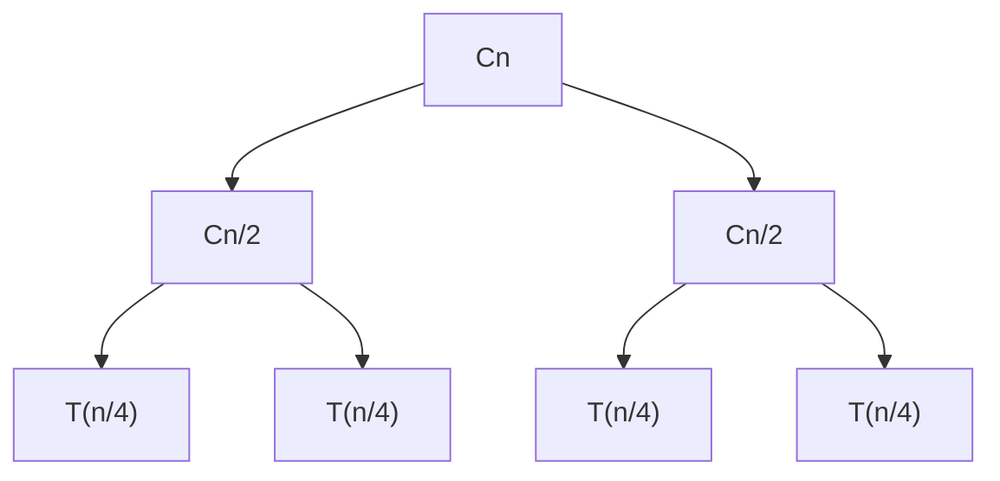
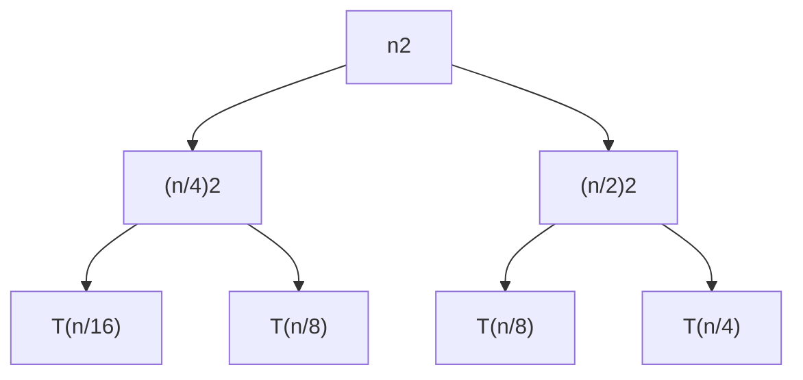

# 第一章 算法分析

## 1.1 引论

### 1.1.1 简单的排序问题

输入：一组顺序数列<a1, a2, ..., an>  
输出：按照大小顺序重新排列后的有序数列<a1', a2', ..., an'>

```c
// 插入排序
InsertionSort(A, n)
for j=2 to n
    do key = A[j]
        i = j-1
        while i>0 and A[i]>key
            do A[i+1] = A[i]
            i = i-1
        A[i+1] = key
```

最好情况：完全顺序
最坏情况：完全逆序

我们通常关注最坏情况下的运行时间，记T(n)为在输入规模n之下的最长的时间消耗。  
有时也会关注平均状态下运行时间，即期望值，记T(n)为在输入规模n之下的平均时间消耗，即时间消耗期望值。

`时间期望 = 基于输入分布情况的运行时间的加权平均`

最好情况下的运行时间是假象，只有特异性输入才会有这种结果，我们完全不考虑，猴子排序的最好情况是常数级

### 1.1.2 究竟如何描述算法的效率？

首先我们分析一段程序所需要的运行时间与什么因素有关。显然，在配置不同的两台计算机上，
同样的程序在配置更好的计算机上运行的速度更快。另外，当输入规模n越大时，时间也会一起增长。
对于不同的编译软件或者语言，同样的算法编译后得到的机器码也大相径庭，进而影响了程序运行速度。

当输入规模n接近无穷大时，加上任何有限的外部因素，优良的算法的效率总是比差劲的算法的效率高。

`我们真正感兴趣的是算法随着输入规模增长的增长。`

### 1.1.3 一个数学记号

 记号：对于一个公式，舍去低阶项，并忽略常数因子

e.g.

)

当n趋近于无穷时，)总是比)更快

分析**插入排序的时间复杂度**

`算术级数`

=\sum_{j=2}^{n}\Theta(j)=\Theta(n^2))

### 1.1.4 另一种排序方法

归并排序，

1. 如果n=1，排序结束  
2. 将序列分割为  和  并分别归并排序  
3. 合并两个分割的序列

记整个归并排序时间复杂度为T(n)
对于步骤一，只需判断1次，时间复杂度是常数级的 )
对于步骤二，它总是分成2次输入规模为n/2的归并排序，因此时间复杂度为2T(n/2)
对于步骤三，合并两个有序表的时间复杂度为 )

则针对归并排序的时间复杂度可列出方程

=\left\\{\begin{array}{l}\Theta(1)\\\\2T(n/2)&plus;\Theta(n)\end{array}\right.)

其中，)是线性的，与cn等价。另外，递归的终止计算与整个过程的时间复杂度没有任何关系。因此，公式可简化为

=2T(n/2)&plus;Cn)

我们对这个递归方程进行树状展开



如上，T(n)可以不断这样分割下去直到递归终结，而T(n)等于整个树所有节点的值的和。

除了最后一级，树的每一级的和都为Cn，最后一级的和为)，树的层数为1+logn，高度为logn。因此最终结果为

=Cn\log&space;n&plus;\Theta(n)=\Theta(n\log&space;n))

## 1.2 渐进符号及递归计算

### 1.2.1 渐进符号的定义

#### *O*记号

1. =O(g(n))\Leftrightarrow\exists(c>0,n_{0}>0),\forall&space;n\geqslant&space;n_{0},0\leqslant&space;f(n)\leqslant&space;cg(n))
2. 关系是非对称的，相当于关系
3. 关系是一个集合，=O(g(n)))实际意义是\in&space;O(g(n)))
4. 关系渐近地给出)的上界

#### *Ω*记号

1. =\Omega(g(n))\Leftrightarrow\exists(c>0,n_{0}>0),\forall&space;n\geqslant&space;n_{0},0\leqslant&space;cg(n)\leqslant&space;f(n))
2. 关系是非对称的，相当于关系
3. 关系是一个集合，=\Omega(g(n)))实际意义是\in\Omega(g(n)))
4. 关系渐近地给出)的下界

#### *Θ*记号

1. =\Theta(g(n))\Leftrightarrow)  
,\forall&space;n\geqslant&space;n_{0},0\leqslant&space;c_{1}g(n)\leqslant&space;f(n)\leqslant&space;c_{2}g(n))
2. 关系是对称的，相当于关系
3. 关系是一个集合，=\Theta(g(n)))实际意义是\in\Theta(g(n)))，是和的交集
4. 关系渐近地给出)的确界

### 1.2.2 递归计算

#### 代换法

1. 猜测最高项；
2. 化为线性形式；
3. 数学归纳法证明。

**e.g.**

=4T(n/2)&plus;n)

**假设** =O(n^3))

`大O记号不能用于数学归纳，首先要化为线性形式`

证明 \leqslant&space;cn^3)

假设成立，则 =4T(n/2)&plus;n\leqslant4c(n/2)^3&plus;n)

即 \leqslant&space;cn^3/2&plus;n)

\leqslant&space;cn^3-(cn^3/2-n))

其中，,cn^3/2-n\geqslant0)

因此此时，\leqslant&space;cn^3)，假设成立

**因此**，=O(n^3))**成立**

虽然但是，)并不是该递归式中)的上确界，严格结果为)，下面给出证明

**假设** =O(n^2))

证明 \leqslant&space;c_{1}n^2-c_{2}n)

假设不等式成立，则 \leqslant4c_{1}(n/2)^2-4c_{2}(n/2)&plus;n)

即 \leqslant&space;c_{1}n^2-2c_{2}n&plus;n)

\leqslant&space;c_{1}n^2-c_{2}n-(c_{2}-1)n)

其中，,(c_{2}-1)n\geqslant0)

因此此时，\leqslant&space;c_{1}n^2-c_{2}n)，假设成立

**因此**，=O(n^2))**成立**

#### 递归树法

1. 将非T的项写在根节点上，将剩余的写在叶节点上
2. 递归地展开叶节点
3. 对所有的节点进行求和，一级一级地求

**e.g.**

=T(n/4)&plus;T(n/2)&plus;n^2)



对每一级求和发现，第1+k层的叶节点的和为 ，树的层数是

对于这个树，右边的子树总是小于左边的，我们将右边补全，可以得到

\leqslant\sum_{k=0}^{\log_{4}n}\frac{5^k}{16^k}n^2)

即 \leqslant2n^2)

因此，=O(n^2))

显然，\geqslant&space;n^2)

所以，=\Omega(n^2))

所以，=\Theta(n^2))

#### 主方法

##### 限制

形式符合 =aT(n/b)&plus;f(n))，其中 ，并且 ) 是渐近趋正的

`渐近趋正表示，当n足够大时，f(n)>0`

##### 方法
