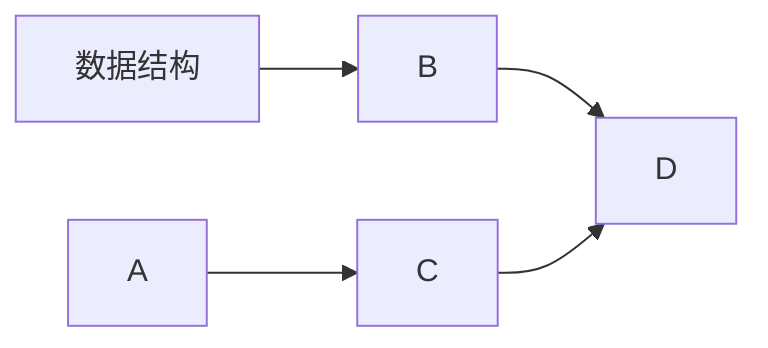

## 1.1.1 基本概念与术语
### 什么是数据？
**数据**：数据是**信息的载体**，是客观描述事物属性的数、
字符及所有能输入到计算机中并**被计算机程序识别和处理**的
符号的集合。数据是计算机程序加工的原料。

**数据元素**：数据元素是数据的基本单位，由若干**数据项**组成  
**数据对象**：具有相同性质的**数据元素**的集合  
**数据结构**：数据元素及数据元素之间的关系

## 1.1.2 数据结构三要素
