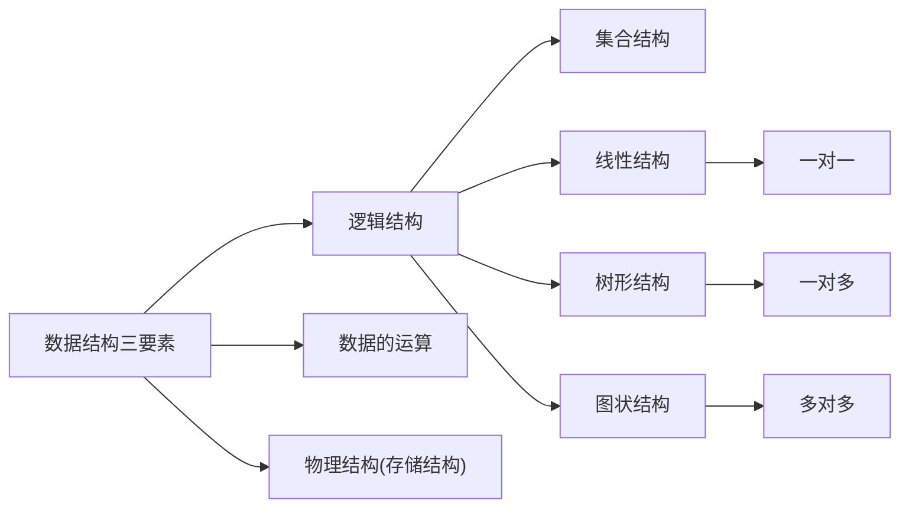
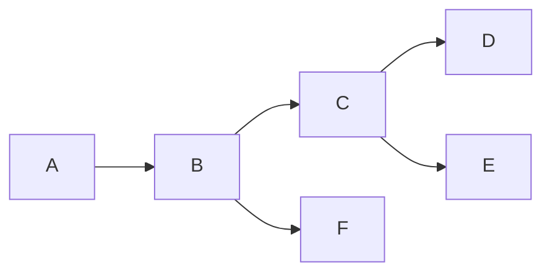
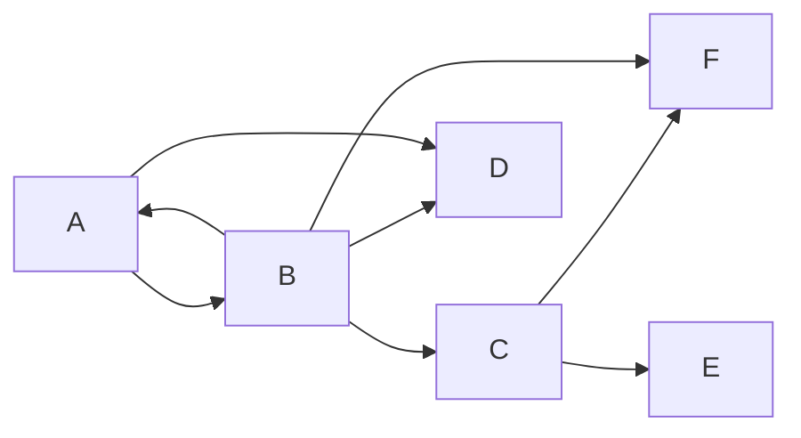
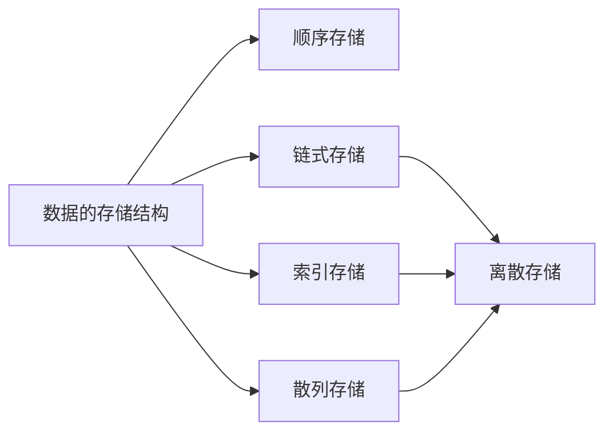
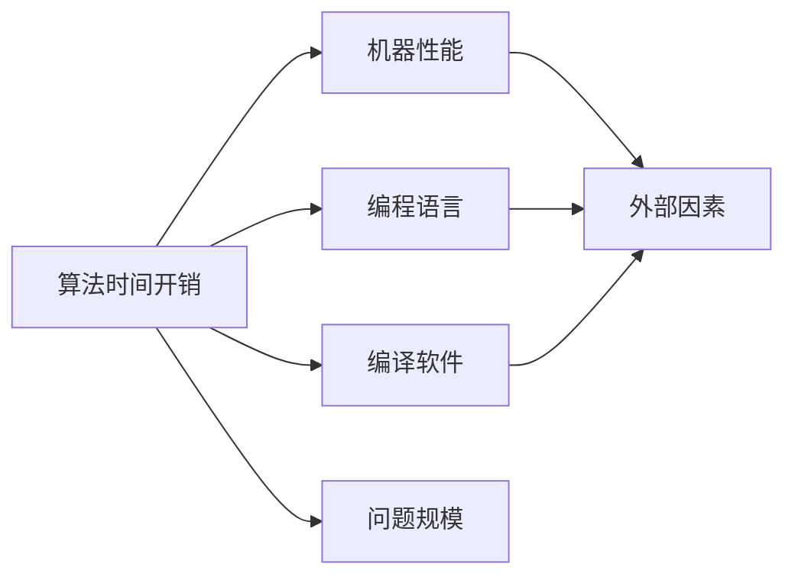

# 1.1 基本概念与术语

## 什么是数据？

**数据**：数据是**信息的载体**，是客观描述事物属性的数、
字符及所有能输入到计算机中并**被计算机程序识别和处理**的
符号的集合。数据是计算机程序加工的原料。

**数据元素**：数据元素是数据的基本单位，由若干**数据项**组成  
**数据对象**：具有相同性质的**数据元素**的集合  
**数据结构**：数据元素及数据元素之间的关系

# 1.2 数据结构三要素

## 逻辑结构

### 集合结构

### 线性结构

除了第一个元素，都有唯一前驱  
除了最后一个元素，都有唯一后继

### 树形结构

数据元素之间是一对多的关系

### 图状结构

数据元素之间是多对多的关系

## 数据的运算

针对于某种逻辑结构，结合实际需求，定义基本运算

## 物理结构

数据的物理结构即存储结构，即如何用计算机表示
数据元素的逻辑关系？

### 顺序存储

把**逻辑上相邻的元素存储在物理上也相邻的存储单元中**，
元素之间的关系由存储单元的邻接关系来体现。

### 链式存储

**逻辑上相邻的元素在物理位置上可以不相邻**，
借助元素存储地址的指针联系起来

### 索引存储

在存储信息的同时，还建立附加的索引表。索引表中的每项称为索引项，索引项的一般形式是(Key, Address)

### 散列存储

根据元素的关键字直接计算出元素的存储地址，又称为哈希(Hash)存储

数据的**存储结构**会影响**存储空间分配的方便程度**  
数据的**存储结构**会影响**对数据的运算速度**

## 数据类型

### 定义

`数据类型`是一个值的集合和定义在此集合上的一组操作的总称

### 原子类型

其值不可再分的数据类型

### 结构类型

其值可以再分解为若干成分的数据类型

## 抽象数据类型(Abstract Data Type)

### 定义

`抽象数据类型`是抽象数据组织及与之相关的操作，不关心数据类型

# 1.3 算法

`程序 = 数据结构 + 算法`

## 算法的特性

* 有穷性
* 结果唯一性

## 复杂度

### 运算规则

a) 加法规则

)&plus;O(g(n))=O(max(f(n),g(n))))

b) 乘法规则

)\times&space;O(g(n))=O(f(n)\times&space;g(n)))

其中

<O(log_{2}n)<O(n)<O(nlog_{2}n)<O(n^2)<O(n^3)<O(2^n)<O(n!)<O(n^n))

同阶

=O(f(n))\Leftrightarrow\displaystyle\lim_{x&space;\to&space;\infty}\frac{T(n)}{f(n)}=k)

### 算法的效率

#### 时间复杂度

事前预估算法**时间开销T(n)**与**问题规模n**的关系
