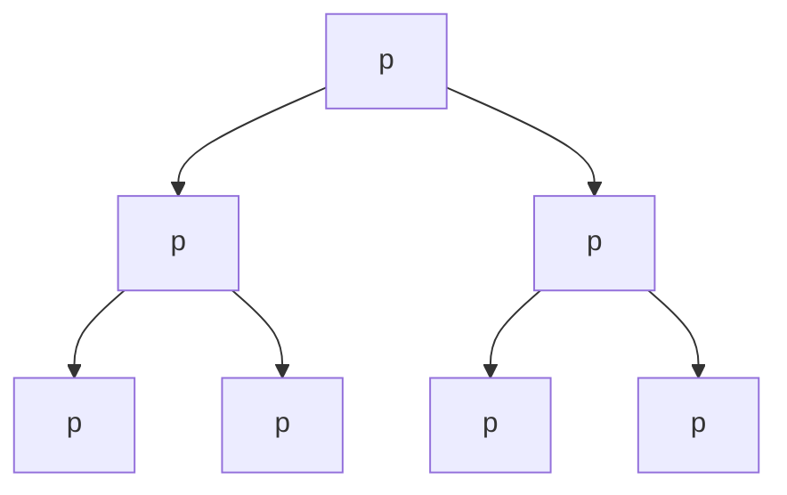
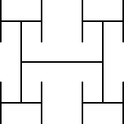

# 第二章 分治法

## 2.1 整体思想

### 2.1.1 分治法的三步骤

1. **分解**：将大的问题规模分解成1个或更多的小的子问题
2. **递归**：递归地解决所有子问题
3. **合并**：合并所有子问题

> 虽然分治法是递归的，但并不意味着实际代码的实现必须使用递归

### 2.1.2 复习归并排序

1. 将数组分成左半部分和右半部分；
2. 递归地排序左半部分和右半部分；
3. 合并两个子数组

归并排序的时间复杂度的递归表达式为 $$T(n)=2T(n/2)+\Theta(n)$$

其中，$n/2$ 是子问题的规模，$T(n/2)$ 是子问题所需要的时间，其系数 $2$ 是子问题的数量，$\Theta(n)$ 是分解步骤和合并步骤所需要的时间

依靠主方法，得出 $$T(n)=\Theta(n\log n)$$

### 2.1.3 二分查找

二分查找算法应用于在一个已排序的序列中找到元素 $x$

1. 将x于序列中间的元素相比较，若x更小，则子序列为左半序列，反之为右半序列（分解）
2. 递归地在子序列中二分查找x（递归）
3. 无

二分查找的特点是，子问题的数目只有1个，我们只需要讨论有x的子序列，而不需要讨论另一个。并且由于子序列只有一个，所以无需合并

因此二分查找的时间复杂度的递归表达式为 $$T(n)=T(n/2)+\Theta(1)$$

易得 $$T(n)=\Theta(\log n)$$

**[递归型二分查找C语言实现](./binary_search.c)**

```c
//二分查找一个数在序列中的位置，存在则返回该元素的下标，如果不存在返回-1
int binary_search(DataType array[], int start, int end, DataType value) {
    int key = -1;
    int length = end - start + 1;
    int mid = (end + start) / 2;
    //长度为2时表示剩余只有两个元素，两边一定都找过了，递归结束，该数并不在序列中
    if(length != 2){
        if (value == array[mid]) {
            key = mid;
        } else if (value < array[mid]) {
            key = binary_search(array, start, mid, value);
        } else if (value > array[mid]) {
            key = binary_search(array, mid, end, value);
        }
    }
    return key;
}
```

### 2.1.4 乘方问题

给一个有理数 $x$，和一个非负整数 $n$，求 $x^n$

1. 当 $n$ 为偶数时，$x^n=x^{n/2}x^{n/2}$，当 $n$ 为奇数时，$x^n=x^{(n-1)/2}x^{(n-1)/2}x$，我们只需求1次 $x^{n/2}$ 或者 $x^{(n-1)/2}$，即分解成了1个子乘方问题
2. 递归地解决子乘方问题
3. 当 $n$ 为偶数时，求1次乘法，当 $n$ 为奇数时，求2次乘法

归并排序的时间复杂度的递归表达式为 $$T(n)=T(n/2)+\Theta(1)$$

易得 $$T(n)=\Theta(\log n)$$

**[乘方分治法C语言实现](./power.c)**

```c
//分治法求乘方
DataType recursive_pow(DataType base, int power) {
    DataType medium;
    DataType result = base;
    if (power != 1) {
        if (power % 2 == 0) {
            medium = recursive_pow(base, power / 2);
            result = medium * medium;
        } else if (power % 2 == 1) {
            medium = recursive_pow(base, (power - 1) / 2);
            result = medium * medium * base;
        }
    }
    return result;
}
```

### 2.1.5 计算方法回顾

#### 主方法

形式符合 $$T(n)=aT(n/b)+f(n)$$

其中 $a\geqslant1,b>0$，并且 $f(n)$ 是渐近趋正的

`渐近趋正表示，当n足够大时，f(n)>0`

比较 $f(n)$ 和 $n^{\log _{b}a}$

`情况一`

$$f(n)=O(n^{\log_{b}a-\epsilon}),\ (\epsilon>0)$$

$$\Rightarrow\quad T(n)=\Theta(n^{\log_{b}a})$$

`情况二`

$$f(n)=\Theta(n^{\log_{b}a}\log^k n),\ (k\geqslant0)$$

$$\Rightarrow\quad T(n)=\Theta(n^{\log_{b}a}\log^{k+1}n)$$

`情况三`

$$f(n)=\Omega(n^{\log_{b}a+\epsilon}),\ (\epsilon>0)$$

$$\And\quad af(n/b)\leqslant(1-\epsilon')f(n),\ (\epsilon'>0)$$

$$\Rightarrow\quad T(n)=\Theta(f(n))$$

## 2.2 斐波那契数列 (Fibonacci sequence)

### 2.2.1 斐波那契数列的直观递归

斐波那契数列的数学定义就是递归的

`催更mathjax3扩展作者快快更新大括号的渲染`

=\left\\{\begin{array}{l}0,\&space;n=0&space;\\\\1,\&space;n=1&space;\\\\F(n-1)&plus;F(n-2),\&space;n\geqslant2\end{array}\right.)

我们可以非常简单地从数学定义中得出递归表达式 $$T(n)=T(n-1)+T(n-2)+\Theta(1)$$

这个结果是指数级的，$$T(n)=\Omega((\frac{1+\sqrt{5}}{2})^n)$$

我们发现，此时使用分治法的效果似乎并不太行儿，原因是我们在分解的步骤中，两个子问题的子问题出现了重复，导致我们做了大量的非必要重复计算。分治法的精髓在于减小问题的规模，而我们在这里却增大了问题的规模。

**[糟糕的斐波那契数列算法](./poor_fibonacci.c)**

```c
long poor_fibonacci(int n) {
    long result = 0;
    if (n != 0 && n != 1) {
        result = poor_fibonacci(n - 1) + poor_fibonacci(n - 2);
    } else if (n == 1) {
        result = 1;
    } else {
        result = 0;
    }
    return result;
}
```

`我们想要多项式时间的算法。`

### 2.2.2 更好的算法——自下而上的解法

依次计算 $F(0)$, $F(1)$, $F(2)$...分别用两个变量缓存 $F(k-1)$ 和 $F(k)$，并相加得出 $F(k+1)$，再将 $F(k)$ 和 $F(k+1)$ 缓存到下一次的 $F(k-1)$ 和 $F(k)$，直到计算出 $F(n)$

`动态规划的思想`

显然，我们需要 $n-1$ 次加法和 $2(n-2)$ 次赋值运算

因此这个算法的时间消耗为 $$T(n)=\Theta(n)$$

**[自下而上的斐波那契数列算法](./dynamic_fibonacci.c)**

```c
//动态规划的思想，自上而下地求出斐波那契数
long dynamic_fibonacci(int n) {
    long result = 1;
    if (n != 0 && n != 1) {
        int key;
        long tmp;
        long pre_pre_number = 0;
        long pre_number = 1;
        
        for (key = 1; key != n; key++) {
            result = pre_number + pre_pre_number;
            tmp = result;
            pre_pre_number = pre_number;
            pre_number = tmp;
        }
    } else if (n == 1) {
        result = 1;
    } else {
        result = 0;
    }
    return result;
}
```

### 2.2.3 最快的算法——朴素平方递归式（计算机难以实现）

斐波那契数列的一个重要结论

$$F(n)=\left \lfloor \frac{\varphi ^n}{\sqrt{5} }  +\frac{1}{2} \right \rfloor $$

$\left \lfloor \frac{\varphi ^n}{\sqrt{5} }  +\frac{1}{2} \right \rfloor $ 的意思是最接近 $\frac{\varphi ^n}{\sqrt{5}}$ 的整数

乘方递归的时间消耗为 $\Theta(\log n)$

但是由于计算机在运算高精度数据过程中总是会丢失一些位，因此这个算法在计算机中难以实现，并且事实上，计算高精度浮点数的乘法并不是常数级的，因此实际计算的时间消耗总是要更久。

### 2.2.4 另辟蹊径——矩阵平方递归式

**定理一** $$\begin{bmatrix}F(n+1)&F(n)\\\\ F(n)&F(n-1)\end{bmatrix}=\begin{bmatrix}1&1\\\\1&0\end{bmatrix}^n$$

乘方递归的时间消耗为 $\Theta(\log n)$

---

**数学归纳法**证明

当 $n=1$ 时，$$\begin{bmatrix}F(2)&F(1)\\\\ F(1)&F(0)\end{bmatrix}=\begin{bmatrix}1&1\\\\1&0\end{bmatrix}^1$$显然成立

假设 $$\begin{bmatrix}F(k+1)&F(k)\\\\ F(k)&F(k-1)\end{bmatrix}=\begin{bmatrix}1&1\\\\1&0\end{bmatrix}^k$$成立

则对于 $k+1$ $$\begin{bmatrix}F(k+2)&F(k+1)\\\\ F(k+1)&F(k)\end{bmatrix}=\begin{bmatrix}1&1\\\\1&0\end{bmatrix}^{k+1}$$

$$=\begin{bmatrix}F(k+1)&F(k)\\\\ F(k)&F(k-1)\end{bmatrix}\begin{bmatrix}1&1\\\\1&0\end{bmatrix}=\begin{bmatrix}F(k+1)+F(k)&F(k+1)\\\\ F(k)+F(k-1)&F(k)\end{bmatrix}$$

显然成立

因此 $$\begin{bmatrix}F(n+1)&F(n)\\\\ F(n)&F(n-1)\end{bmatrix}=\begin{bmatrix}1&1\\\\1&0\end{bmatrix}^n$$ 成立

---

两个 $2\times 2$ 的矩阵的乘法只需要 $12$ 次计算，是常数级的，因此整个算法的时间消耗为

$$T(n)=\Theta(\log n)$$

**[使用矩阵乘方的斐波那契数列算法](./matrix_power_fibonacci.c)**

```c
//利用斐波那契数列的矩阵表达式，二分地求出斐波那契数
long matrix_power_fibonacci(int n) {
    long **result_matrix = (long **) malloc(2 * sizeof(long *));
    int i;
    for (i = 0; i < 2; i++) {
        result_matrix[i] = (long *) malloc(2 * sizeof(long));
    }
    result_matrix[0][0] = 1;
    result_matrix[0][1] = 1;
    result_matrix[1][0] = 1;
    result_matrix[1][1] = 0;
    result_matrix = matrix_pow(result_matrix, n);
    return result_matrix[0][1];
}
```

```c
//矩阵乘方
long **matrix_pow(long **base_matrix, int power){
    long **medium;
    long **result = base_matrix;
    if (power != 1) {
        if (power % 2 == 0) {
            medium = matrix_pow(base_matrix, power / 2);
            result = two_by_two_matrix_multiple(medium, medium);
        } else if (power % 2 == 1) {
            medium = matrix_pow(base_matrix, (power - 1) / 2);
            result = two_by_two_matrix_multiple(two_by_two_matrix_multiple(medium, medium), base_matrix);
        }
    }
    return result;
}
```

```c
//2X2的矩阵乘法
long **two_by_two_matrix_multiple(long **matrix1, long **matrix2) {
    long **result = (long **) malloc(2 * sizeof(long *));
    int i;
    for (i = 0; i < 2; i++) {
        result[i] = (long *) malloc(2 * sizeof(long));
    }
    result[0][0] = matrix1[0][0] * matrix2[0][0] + matrix1[0][1] * matrix2[1][0];
    result[0][1] = matrix1[0][0] * matrix2[0][1] + matrix1[0][1] * matrix2[1][1];
    result[1][0] = matrix1[1][0] * matrix2[0][0] + matrix1[1][1] * matrix2[1][0];
    result[1][1] = matrix1[1][0] * matrix2[0][1] + matrix1[1][1] * matrix2[1][1];
    return result;
}
```

那对于一般的矩阵乘法，时间消耗还是常数级的吗？

## 2.3 矩阵乘法

### 2.3.1 基本概念

由 $m\times n$ 个数排成的 $m$ 行 $n$ 列的数表称为 $m$ 行 $n$ 列的矩阵，简称 $m\times n$ 矩阵。记作：$$A=\begin{bmatrix}a_{11}&a_{12}&...&a_{1n}\\\\ a_{21}&a_{22}&...&a_{2n}\\\\...& ...& ...&...\\\\ a_{m1}&a_{m2}&...&a_{mn}\end{bmatrix}$$

记第 $i$ 行，第 $j$ 列的元素为 $a_{ij}$

#### 矩阵的和

若存在两个 $m\times n$ 的矩阵 $\textbf{A}$ 和 $\textbf{B}$，则记矩阵 $\textbf{A}$ 和矩阵 $\textbf{B}$ 的和为 $m\times n$ 的矩阵 $\textbf{C}$，其中

$$c_{ij}=a_{ij}+b_{ij}$$

考虑两个 $n\times n$ 的方阵 $\textbf{A}$ 和 $\textbf{B}$，计算它们的和。计算每一个元素需要 $1$ 次加法，一共要计算 $n^2$ 个元素，因此总的时间消耗为 $$T(n)=\Theta(n^2)$$

#### 矩阵的积

若存在一个 $m\times r$ 的矩阵 $\textbf{A}$ 和一个 $r\times n$ 的矩阵 $\textbf{B}$，则记矩阵 $\textbf{A}$ 和矩阵 $\textbf{B}$ 的乘积为 $m\times n$ 的矩阵 $\textbf{C}$，其中

$$c_{ij}=\sum_{k=1}^{r}a_{ik}b_{kj}$$

考虑两个 $n\times n$ 的方阵 $\textbf{A}$ 和 $\textbf{B}$，计算它们的乘积。计算每一个元素需要 $n$ 次乘法和 $n-1$ 次加法，一共要计算 $n^2$ 个元素，因此总的时间消耗为 $$T(n)=\Theta(n^3)$$

### 2.3.2 一个简单的分治算法

将方阵 $\textbf{A}$、$\textbf{B}$ 和 $\textbf{C}$ 都分解为一个 $2\times2$ 的子矩阵，其中的每个元素都是矩阵，我们可以得到如下式子

$$\begin{bmatrix}C_{11}&C_{12}\\\\C_{21}&C_{22}\end{bmatrix}=\begin{bmatrix}A_{11}&A_{12}\\\\A_{21}&A_{22}\end{bmatrix}\times\begin{bmatrix}B_{11}&B_{12}\\\\B_{21}&B_{22}\end{bmatrix}$$

我们可以将问题转化为求

$$C_{11}=A_{11}B_{11}+A_{12}B_{21}$$

$$C_{12}=A_{11}B_{12}+A_{12}B_{22}$$

$$C_{21}=A_{21}B_{11}+A_{22}B_{21}$$

$$C_{22}=A_{21}B_{12}+A_{22}B_{22}$$

每一个式子是 $2$ 次 $n/2\times n/2$ 的矩阵的乘法和 $1$ 次 $n/2\times n/2$ 矩阵的加法，一共有 $4$ 个式子。其中，$n/2\times n/2$ 的矩阵的乘法时间消耗为 $T(n/2)$，$n/2\times n/2$ 矩阵的加法时间消耗为 $\Theta(n^2)$

因此可以得出递归表达式 $$T(n)=8T(n/2)+\Theta(n^2)$$

依靠主方法可以得出 $$T(n)=\Theta(n^3)$$

这并不比前面的算法更优秀

### 2.3.3 Strassen 算法

矩阵的乘法需要 $\Theta(n^3)$ 的时间，而加法只需要 $\Theta(n^2)$，因此我们想办法避开乘法而使用加法。Strassen 算法成功地将前面的 $8$ 次乘法减少到了 $7$ 次，这使我们的算法会更快一些。

我们构造这样7个矩阵

$$P_{1}=A_{11}(B_{12}-B_{22})$$

$$P_{2}=(A_{11}+A_{12})B_{22}$$

$$P_{3}=(A_{21}+A_{22})B_{11}$$

$$P_{4}=A_{22}(B_{21}-B_{11})$$

$$P_{5}=(A_{11}+A_{22})(B_{11}+B_{22})$$

$$P_{6}=(A_{11}+A_{22})(B_{21}+B_{22})$$

$$P_{7}=(A_{11}-A_{21})(B_{11}+B_{12})$$

构造这7个矩阵总共需要10次加法和7次乘法

我们尝试通过上面的7个矩阵，构造矩阵 $\textbf{C}$

$$C_{11}=P_{4}+P_{5}+P_{6}-P_{2}$$

$$C_{12}=P_{1}+P_{2}$$

$$C_{21}=P_{3}+P_{4}$$

$$C_{22}=P_{5}-P_{1}-P_{3}-P_{7}$$

这样，我们就成功地通过20次加法和7次乘法，将矩阵 $\textbf{A}$ 和 $\textbf{B}$ 变成了矩阵 $\textbf{C}$

再根据上面的分析，可以得出此时的递归表达式为 $$T(n)=7T(n/2)+\Theta(n^2)$$

结果为 $$T(n)=\Theta(n^{\log7})\approx\Theta(n^{2.81})$$

我们成功地提高了矩阵乘法的速度，不过目前最快的矩阵乘法算法的速度达到了 $\Theta(n^{2.376})$，虽然纯粹是理论上的改进。

## 2.4 超大规模集成电路（Very Large-Scale Integration）

### 2.4.1 概述

我们假设电路是一个二叉树（binary tree），假设现在有一个完全二叉树，这个二叉树有n个叶节点，我们想将它放在芯片布局上，并占据最小空间。

这个问题严格上来说不是一个算法问题，但我们可以从中体会到`分治法`的运用。

### 2.4.2 朴素布局

我们尝试直接将二叉树竖着排列下来



我们记树的高度为 $H(n)$，树的宽度为 $W(n)$

将树都看成左右两颗子树加上根节点，并递归地看待所有子树，这样我们便能得到两个递归式

$$T(n)=T(n/2)+\Theta(1)$$

$$W(n)=2W(n/2)+\Theta(1)$$

简单地解得

$$T(n)=\Theta(\log n),\ W(n)=\Theta(n)$$

这样我们就能得到所占用的面积

$$S(n)=T(n)W(n)=\Theta(n\log n)$$

### 2.4.3 H布局



使用这种布局，我们就拥有了4个一样的子问题，事实上，当我们考虑高度时，只需要讨论2个子问题，同样的，当我们考虑宽度时，也只需要讨论2个子问题。这样我们就得到了两个递归式

$$T(n)=2T(n/4)+\Theta(1)$$

$$W(n)=2W(n/4)+\Theta(1)$$

简单地解得

$$T(n)=\Theta(\sqrt{n}),\ W(n)=\Theta(\sqrt{n})$$

因此这种方法所占用的面积为

$$S(n)=T(n)W(n)=\Theta(n)$$
