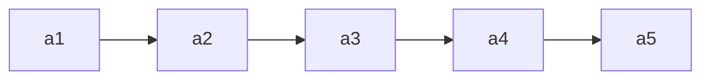

# 2.1 线性表

## 定义

线性表是具有**相同数据类型**的n(n≥0)个数据元素的**有限序列**，其中n为**表长**，当n=0时线性表是一个空表。
若用L命名线性表，则其一般表示为

)



除第一个元素外，每个元素有唯一前驱，除最后一个元素外，每个元素有唯一后继

## 基本操作

* **InitList(&L)**：初始化表。构造一个空的线性表，分配内存空间。
* **DestroyList(&L)**：销毁表。销毁线性表，并释放该线性表所占用的内存空间。
* **ListInsert(&L, i, e)**：插入。在表L的位置i插入元素e。
* **ListDelete(&L, i, &e)**：删除。删除表L的位置i的元素，并返回给e。
* **LocateElem(L, e)**：按值查找。在表L中查找元素e的位置。
* **GetElem(L, i)**：按位查找。获取表L中位置i的元素的值。

所有数据结构的基本操作————增删改查

`Tips：以上命名方式来自严蔚敏老师的《数据结构》`

## 2.1.1 顺序表

### 定义

顺序表是用**顺序存储**方式实现的线性表。

### 实现

#### 1.静态分配

```c
#define MaxSize 10

typedef struct {
    ElemType data[MaxSize];     //静态数组存放数据元素
    int length;
} SqList;
```
