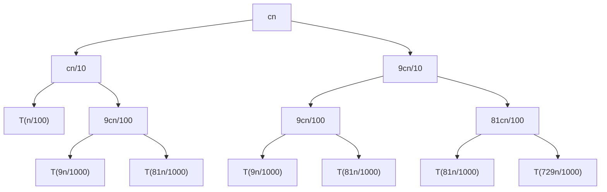

# 第三章 快速排序与随机化算法

## 3.1 快速排序（Quicksort or Partition-Exchange Sort）

### 3.1.1 概述

快速排序是一种分治算法，并且它在原地排序，这意味着它不需要其他的数据区域，即空间复杂度为 $O(1)$

快速排序是一种灵活性很高的算法，如果原始的快排算法的速度不尽人意，那么只需要按照标准方法做一点小小的改进，就能获得很高的效率

### 3.1.2 步骤

快速排序使用的主要方法是分治法

1. 分解：快速排序通过选取一个**关键值**，并根据该值将数组分为两部分，其中一部分的数值都小于或等于它，另一部分的数值都大于它
2. 递归：递归地快速排序子数组
3. 合并：无需刻意合并

`分解步骤`

首先选取第一个元素为关键值，然后依次检查后面的元素。索引 i 代表一个界限，i 前面的元素都比关键值小，i 后面的元素都比关键值大。索引 j 代表它后面的元素还未检查到。如果位置 j 的元素小于等于关键值，则将 i 后面的第一个元素（该元素大于关键值）与位置 j 的元素（该元素小于等于关键值）互换位置，然后再把 i + 1。这样做之后，此时的 i 的元素就是刚刚 j 的元素，在界限 i 的前面，而刚刚 i 后一个元素仍然在界限 i 的后面。j 的检查完毕后，将此时 i 的元素和第一个元素替换位置，并返回 i。

```c
// 数组的划分
Partition(A, p, q)
    x = A[p]    //选取关键值
    i = p - 1
    for j = p to q
        if A[j] <= x
            exchange A[i + 1] with A[j]
            i = i + 1
    exchange A[p] with A[i]
    return i
```

分解的时间消耗为 $\Theta(n)$1

`递归步骤`

```c
// 快速排序
Quicksort(A, p, q)
    if p < q
        r = Partition(A, p, q)
        Quicksort(A, p, r - 1)
        Quicksort(A, r + 1, q)
    return
```

### 3.1.3 时间消耗计算

`最差的情况`

我们假设 $T(n)$ 是最差情况的运行时间消耗，思考什么时候会出现这种情况？

如果我们每次分解数组时，都出现了一边倒，那每次递归的子问题规模仅仅是 $n-1$，这是非常糟糕的。可以想象，如果这个数组已经顺序或者逆序排列好时，就会出现这个情况。我们计算此时的时间复杂度。

$$T(n)=T(n-1)+T(0)+\Theta(n)$$

$$T(n)=T(n-1)+\Theta(1)+\Theta(n)$$

$$T(n)=T(n-1)+\Theta(n)$$

最终结果为 $$T(n)=\Theta(n^2)$$

这甚至不如插入排序

`最优的情况`

我们一般不研究最优情况，但这里可以帮助我们理解。

如果我们每次分划数组时，正好从中间分开，两边的子问题规模都是 $n/2$。

$$T(n)=2T(n/2)+\Theta(n)$$

易得 $$T(n)=\Theta(n\log n)$$

`其他情况一`

假设每次分划时，两边的问题规模比都是 $\frac{1}{10}:\frac{9}{10}$

$$T(n)=T(n/10)+T(9n/10)+\Theta(n)$$



树的最左边叶节点的高度为 $\log_{10}n$，最右边叶节点的高度为 $\log_{\frac{10}{9}}n$，每一层的和为 $cn$，最终结果为 $$cn\log_{10}n+\Theta(n)\leqslant T(n)\leqslant cn\log_{\frac{10}{9}}n+\Theta(n)$$

即时间消耗为 $$T(n)=\Theta(n\log n)$$

`其他情况二`

假设每次分划时，这一次是最好情况，而下一次是最坏情况，交替进行。假设这一步是最好情况的时间消耗为 $L(n)$，最坏情况的时间消耗为 $U(n)$

则 $$L(n)=2U(n/2)+\Theta(n)$$

$$U(n)=L(n-1)+\Theta(n)$$

可以得到 $$L(n)=2(L(\frac{n}{2}-1)+\Theta(\frac{n}{2}))+\Theta(n)$$

$$L(n)=2L(\frac{n}{2}-1)+\Theta(n)$$

$$L(n)=\Theta(n\log n)$$

我们发现，似乎只要不是已经排好顺序或者逆序，这个程序就是非常优秀的，是 $\Theta(n\log n)$。如何保证我们总是能在 $\Theta(n\log n)$ 的时间内运行呢？

### 3.1.5 随机化快速排序（Randomized Quicksort）

随机化快速排序与原始快速排序相比，仅仅改变了分解步骤的程序。在分解部分，我们不再直接选择第一个元素作为主元，而是在序列中随机选择一个元素作为主元。

```c
Randomized_Partition(A, p, r)
    i = Random(p, r)
    exchange A[p] with A[i]     //将随机选择的元素与第一个元素交换位置
    return Partition(A, p, r)
```

- 随机化快速排序的优点是运行时间与原始序列顺序无关，无需对输入的序列做任何假设。

- 没有任何一种序列会产生最差的运行效率。

- 最差的情况由随机数生成器决定。

假设 $T(n)$ 为运行时间的随机变量，选择随机数的过程是独立的。

我们想知道哪一个元素被选为主元，这里引入**指示器随机变量** $X_{k}$

在 $k=0,1,...,n-1$ 中，如果第 k 个元素被选择为主元，则 $X_{k}=1$，否则 $X_{k}=0$

---

`随机变量的期望值`

$$E[X]=\sum_{x}x\bullet \Pr \\{X=x\\} $$

---

$X_{k}$ 的期望为

---

---

---

---
