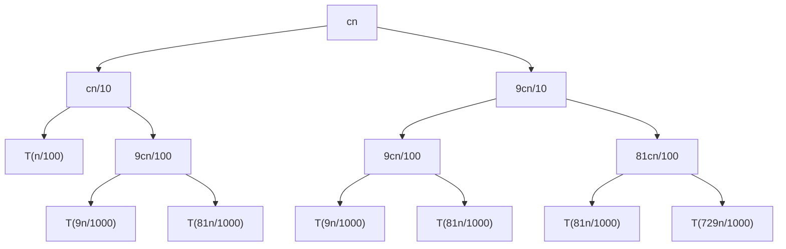
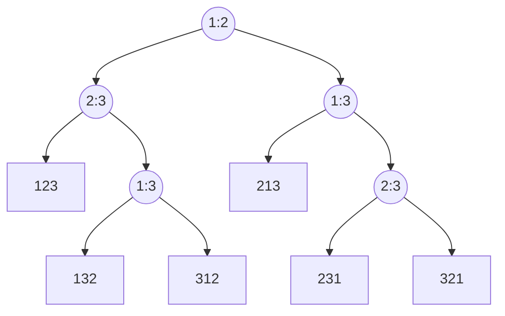

# 第三章 排序

## 3.1 快速排序（Quicksort or Partition-Exchange Sort）

### 3.1.1 概述

快速排序是一种分治算法，并且它在原地排序，这意味着它不需要其他的数据区域，即空间复杂度为 $O(1)$

快速排序是一种灵活性很高的算法，如果原始的快排算法的速度不尽人意，那么只需要按照标准方法做一点小小的改进，就能获得很高的效率

### 3.1.2 步骤

快速排序使用的主要方法是分治法

1. 分解：快速排序通过选取一个**关键值**，并根据该值将数组分为两部分，其中一部分的数值都小于或等于它，另一部分的数值都大于它
2. 递归：递归地快速排序子数组
3. 合并：无需刻意合并

`分解步骤`

首先选取第一个元素为关键值，然后依次检查后面的元素。索引 i 代表一个界限，i 前面的元素都比关键值小，i 后面的元素都比关键值大。索引 j 代表它后面的元素还未检查到。如果位置 j 的元素小于等于关键值，则将 i 后面的第一个元素（该元素大于关键值）与位置 j 的元素（该元素小于等于关键值）互换位置，然后再把 i + 1。这样做之后，此时的 i 的元素就是刚刚 j 的元素，在界限 i 的前面，而刚刚 i 后一个元素仍然在界限 i 的后面。j 的检查完毕后，将此时 i 的元素和第一个元素替换位置，并返回 i。

```c
// 数组的划分
Partition(A, p, q)
    x = A[p]    //选取关键值
    i = p
    for j = p to q
        if A[j] <= x
            exchange A[i + 1] with A[j]
            i = i + 1
    exchange A[p] with A[i]
    return i
```

分解的时间消耗为 $\Theta(n)$

`递归步骤`

```c
// 快速排序
Quicksort(A, p, q)
    if p < q
        r = Partition(A, p, q)
        Quicksort(A, p, r - 1)
        Quicksort(A, r + 1, q)
    return
```

**[快速排序](./quicksort.c)**

```c
// 选择第一个元素为主元，将小于等于主元的放到主元左边，其余放到右边
int partition(DataType array[], int s, int e) {
    DataType key = array[s];
    int i = s;
    DataType tmp;
    int j;
    for (j = i + 1; j <= e; j++) {
        if (array[j] <= key){
            tmp = array[j];
            array[j] = array[i+1];
            array[i+1] = tmp;
            i++;
        }
    }
    tmp = array[s];
    array[s] = array[i];
    array[i] = tmp;
    return i;
}
```

```c
//改变原数组，参数：array（原数组），s（start），e（end）
void quicksort(DataType array[], int s, int e) {
    if (s < e) {
        int m = partition(array, s, e);
        quicksort(array, s, m - 1);
        quicksort(array, m + 1, e);
    }
}
```

### 3.1.3 最差的情况与最好的情况

`最差的情况`

我们假设 $T(n)$ 是最差情况的运行时间消耗，思考什么时候会出现这种情况？

如果我们每次分解数组时，都出现了一边倒，那每次递归的子问题规模仅仅是 $n-1$，这是非常糟糕的。可以想象，如果这个数组已经顺序或者逆序排列好时，就会出现这个情况。我们计算此时的时间复杂度。

$$T(n)=T(n-1)+T(0)+\Theta(n)$$

$$T(n)=T(n-1)+\Theta(1)+\Theta(n)$$

$$T(n)=T(n-1)+\Theta(n)$$

最终结果为 $$T(n)=\Theta(n^2)$$

这甚至不如插入排序

`最好的情况`

我们一般不研究最优情况，但这里可以帮助我们理解。

如果我们每次分划数组时，正好从中间分开，两边的子问题规模都是 $n/2$。

$$T(n)=2T(n/2)+\Theta(n)$$

易得 $$T(n)=\Theta(n\log n)$$

### 3.1.4 一般情况

`一般情况一`

假设每次分划时，两边的问题规模比都是 $\frac{1}{10}:\frac{9}{10}$

$$T(n)=T(n/10)+T(9n/10)+\Theta(n)$$



树的最左边叶节点的高度为 $\log_{10}n$，最右边叶节点的高度为 $\log_{\frac{10}{9}}n$，每一层的和为 $cn$，最终结果为 $$cn\log_{10}n+\Theta(n)\leqslant T(n)\leqslant cn\log_{\frac{10}{9}}n+\Theta(n)$$

即时间消耗为 $$T(n)=\Theta(n\log n)$$

`一般情况二`

假设每次分划时，这一次是最好情况，而下一次是最坏情况，交替进行。假设这一步是最好情况的时间消耗为 $L(n)$，最坏情况的时间消耗为 $U(n)$

则 $$L(n)=2U(n/2)+\Theta(n)$$

$$U(n)=L(n-1)+\Theta(n)$$

可以得到 $$L(n)=2(L(\frac{n}{2}-1)+\Theta(\frac{n}{2}))+\Theta(n)$$

$$L(n)=2L(\frac{n}{2}-1)+\Theta(n)$$

$$L(n)=\Theta(n\log n)$$

我们发现，似乎只要不是已经排好顺序或者逆序，这个程序就是非常优秀的，是 $\Theta(n\log n)$。如何保证我们总是能在 $\Theta(n\log n)$ 的时间内运行呢？

## 3.2 随机化快速排序（Randomized Quicksort）

### 3.2.1 概述

随机化快速排序与原始快速排序相比，仅仅改变了分解步骤的程序。在分解部分，我们不再直接选择第一个元素作为主元，而是在序列中随机选择一个元素作为主元。

```c
Randomized_Partition(A, p, r)
    i = Random(p, r)
    exchange A[p] with A[i]     //将随机选择的元素与第一个元素交换位置
    return Partition(A, p, r)
```

- 随机化快速排序的优点是运行时间与原始序列顺序无关，无需对输入的序列做任何假设。

- 没有任何一种序列会产生最差的运行效率。

- 最差的情况由随机数生成器决定。

**[随机化快速排序](./randomized_quicksort.c)**

```c
// 随机选择主元
int randomized_partition(DataType array[], int s, int e) {
    int a;
    srand((unsigned)time(NULL));
    a = rand() % (s - e) + s;
    DataType tmp = array[s];
    array[s] = array[a];
    array[a] = tmp;
    
    DataType key = array[s];
    int i = s;
    int j;
    for (j = i + 1; j <= e; j++) {
        if (array[j] <= key){
            tmp = array[j];
            array[j] = array[i+1];
            array[i+1] = tmp;
            i++;
        }
    }
    tmp = array[s];
    array[s] = array[i];
    array[i] = tmp;
    return i;
}
```

```c
//改变原数组，参数：array（原数组），s（start），e（end）
void randomized_quicksort(DataType array[], int s, int e) {
    if (s < e) {
        int m = randomized_partition(array, s, e);
        randomized_quicksort(array, s, m - 1);
        randomized_quicksort(array, m + 1, e);
    }
}
```

### 3.2.2 时间消耗计算

假设 $T(n)$ 为运行时间的随机变量，选择随机数的过程是独立的。

我们想知道哪一个元素被选为主元，这里引入**指示器随机变量** $X_{k}$

在 $k=0,1,...,n-1$ 中，如果第 $k$ 个元素被选择为主元并产生了 $k:n-k-1$ 的分划，则 $X_{k}=1$；否则 $X_{k}=0$

---

`随机变量的期望值`

$$E[X]=\sum_{x}x\cdot\Pr(X=x)$$

---

$X_{k}$ 的期望为 $$E[X_{k}]=\Pr(X_{k}=1)=\frac{1}{n}$$

可以写出 $$T(n)=$$

$$T(0)+T(n-1)+\Theta(n),\ if\ 0:n-1\ split$$

$$T(1)+T(n-2)+\Theta(n),\ if\ 1:n-2\ split$$

$$...$$

$$T(n-1)+T(0)+\Theta(n),\ if\ n-1:0\ split$$

因为只有第 $k$ 个元素被选择为主元并产生了 $k:n-k-1$ 的分划时，$X_{k}=1$，因此我们可以将式子写成以下形式

$$T(n)=\sum_{k=0}^{n-1}X_{k}\cdot(T(k)+T(n-k-1)+\Theta(n))$$

$T(n)$ 的期望值为

$$E[T(n)]=E[\sum_{k=0}^{n-1}X_{k}(T(k)+T(n-k-1)+\Theta(n))]$$

`期望的和等于和的期望`

$$E[T(n)]=\sum_{k=0}^{n-1}E[X_{k}\cdot(T(k)+T(n-k-1)+\Theta(n))]$$

`相互独立时，期望的积等于积的期望`

$$E[T(n)]=\sum_{k=0}^{n-1}E[X_{k}]\cdot E[T(k)+T(n-k-1)+\Theta(n)]$$

$$=\frac{1}{n}\sum_{k=0}^{n-1}E[T(k)]+\frac{1}{n}\sum_{k=0}^{n-1}E[T(n-k-1)]+\frac{1}{n}\sum_{k=0}^{n-1}\Theta(n)$$

其中 $\sum_{k=0}^{n-1}E[T(k)]$ 是从 $T(0)$ 加到 $T(n-1)$，而 $\sum_{k=0}^{n-1}E[T(n-k-1)]$ 是从 $T(n-1)$ 加到 $T(0)$，显然这两项相等

所以

$$E[T(n)]=\frac{2}{n}\sum_{k=0}^{n-1}E[T(k)]+\Theta(n)$$

将 $k=0$ 和 $k=1$ 两种情况提取出来，因为后面我们将用到 $\log$

$$E[T(n)]=\frac{2}{n}\sum_{k=2}^{n-1}E[T(k)]+\frac{2}{n}E[T(0)]+\frac{2}{n}E[T(1)]+\Theta(n)$$

其中 $T(0)$ 和 $T(1)$ 都是常数级的，$\frac{2}{n}E[T(0)]+\frac{2}{n}E[T(1)]$ 仅仅是往 $\Theta(n)$ 中加了更多的常数，因此 $\frac{2}{n}E[T(0)]+\frac{2}{n}E[T(1)]+\Theta(n)$ 仍然是 $\Theta(n)$，因此

$$E[T(n)]=\frac{2}{n}\sum_{k=2}^{n-1}E[T(k)]+\Theta(n)$$

现在来证明

$$E[T(n)]=O(n\log n)$$

即证明存在足够大的常数 $c$，使得

$$E[T(n)]\leqslant cn\log n$$

`一个不等式`

$$\sum_{k=2}^{n-1}k\log k\leqslant\frac{1}{2}n^2\log n-\frac{1}{8}n^2$$

假设 $E[T(n)]\leqslant cn\log n$ 成立，则有

$$E[T(n)]\leqslant\frac{2}{n}\sum_{k=2}^{n-1}ck\log k+\Theta(n)$$

$$\leqslant\frac{2c}{n}(\frac{1}{2}n^2\log n-\frac{1}{8}n^2)+\Theta(n)$$

$$=cn\log n-(\frac{cn}{4}-\Theta(n))$$

我们总能找到一个足够大的 $c$ 使得 $$\frac{cn}{4}-\Theta(n)\geqslant 0$$

因此，最终结果为

$$E[T(n)]\leqslant cn\log n$$

假设成立，因此

$$E[T(n)]=O(n\log n)$$

成立

## 3.3 线性时间排序

### 3.3.1 排序能达到多快？

- **快速排序** 平均：$\Theta(n\log n)$，最坏：$\Theta(n^2)$
- **归并排序** $\Theta(n\log n)$
- **插入排序** $\Theta(n^2)$

以上所有算法都没有超过 $\Theta(n\log n)$，可以比这更快吗？

事实上，我们发现以上的排序方法都使用了同一个模型，及比较两个数据的大小来决定相对位置。这个模型叫做比较排序，在该模型中，最快的速度是 $\Theta(n\log n)$

`排序的速度取决于你使用的模型，这个模型包括你可以对数据元素进行的所有操作。`

### 3.3.2 比较排序（Comparison Sort）

在一个比较排序算法中，我们只使用元素间的比较来获得输入序列 $<a_{1},a_{2},...,a_{n}>$ 中的元素间次序的信息。也就是说，给定两个元素 $a_{i}$ 和 $a_{j}$ 可以执行 $a_{i}<a_{j},a_{i}=a_{j},a_{i}>a_{j}$ 中的一个比较操作来确定它们之间的相对次序。我们不能用其他方法观察元素的值或者它们之间的次序信息。

#### 决策树模型（Decision-Tree Model）

$e.g.$ 对 $<a_{1},a_{2},a_{3}>$ 进行排序

画出决策树



$i:j$ 表示如果 $a_{i}\leqslant a_{j}$ 则走左边的路径；否则走右边的，叶节点表示最后的下标序列。

假设存在这样一个序列 $<a_{1},a_{2},...,a_{n}>$

- 存在一对下标 $i:j$，其中 $i$ 和 $j$ 分别在 $1$ 到 $n$ 之间
- 左边的子树说明，在 $a_{i}\leqslant a_{j}$ 的情况下，算法要做什么；反之是右边的子树
- 每个叶节点代表一个序列 $<\pi(1),\pi(2),...,\pi(n)>$，这个序列能保证走完一个决策树后得出的序列满足 $a_{\pi(1)}\leqslant a_{\pi(2)}\leqslant...\leqslant a_{\pi(n)}$

要认识到的是，对于一个长度为 $n$ 的序列，全排列数量为 $A_{n}^{n}=n!$，因此这不是一个很好的描述排序算法的方式。

但是，决策树能清晰地分析比较排序的过程。

#### 通过决策树模型分析比较排序

任何比较排序都可以写成决策树模型的表示

1. 为每一个n值绘制一颗决策树
2. 进行比较时，把数分为左子树和右子树两个部分
3. 决策树将所有的结果列出来，算法终将走到决策树的一个叶节点

每一次排序，对应一条从根节点到唯一一个叶节点的路径；算法的时间消耗等于这条路径的深度。

问题规模为n时，最坏情况运行时间等于树的最长路径也就是树的高度。

**定理**：任意比较排序的决策树的高度的至少是 $\Omega(n\log n)$

证明

前提1：决策树的叶节点的数量至少是 $n!$

前提2：一个高度为 $h$ 的决策树（二叉树）的叶节点数量最大为 $2^h$

因此有

$$n!\leqslant 2^h$$

所以

$$h\geqslant \log n!$$

`斯特林公式`

$$\log n! \geqslant \log (\frac{n}{e})^n$$

因此

$$h\geqslant \log (\frac{n}{e})^n$$

$$h\geqslant n\log (\frac{n}{e})$$

$$h\geqslant n(\log n - \log e)$$

所以

$$h=\Omega(n\log n)$$

可以看出，所有比较排序都至少需要 $\Omega(n\log n)$ 次排序。

**在比较排序算法中，归并排序和堆排序是渐进最优的。**

**随机化快速排序在理想状况下是渐进最优的，即期望最优的。**

### 3.3.3 计数排序（Counting Sort）

输入 $A[1...n]$，其中 $A[i]\in [1,k]\And A[i]\in\Z$

输出 $B[1...n]$，为 $A[1...n]$ 的排序

辅助存储序列 $C[1...k]$

```c
Counting_Sort:
    for i = 1 to k
        C[i] = 0    //将辅助存储序列置0
    for j = 1 to n
        C[A[j]]++   //C的第k位存储着A中等于k的元素的数量
    for i = 2 to k
        C[i] = C[i] + C[i-1]    //将C的第k位变成储存着A中小于等于k的元素的数量
    for j = n downto 1
        B[C[A[j]]] = A[j]       //将A中的元素放在B的正确的位置
        C[A[j]]--
```

计数排序的时间消耗为 $O(k+n)$，当 $k<=n$ 时，这个算法运行的非常好。

但计数排序不仅要求所有元素都是整数，还要求元素的大小不超过 $n$，在处理大数据上效率并不尽人意。

**[计数排序](./counting_sort.c)**

```c
int *counting_sort(const int array[], int length, int max) {
    int i;
    int *side_array = (int *) malloc((max + 1) * sizeof(int));
    int *sorted_array = (int *) malloc(length * sizeof(int));
    for (i = 0; i < (max + 1); i++) {
        side_array[i] = 0;
    }
    for (i = 0; i < length; i++) {
        side_array[array[i]]++;
    }
    for (i = 1; i < (max + 1); i++) {
        side_array[i] += side_array[i - 1];
    }
    for (i = length - 1; i >= 0; i--){
        sorted_array[side_array[array[i]] - 1] = array[i];
        side_array[array[i]]--;
    }
    return sorted_array;
}
```

#### 稳定排序

如果序列中具有一对大小相等的元素 $a_{1},a_{2}$，在排序后这一对元素的相对位置保持不变，则称该排序算法是稳定的。计数排序是一种稳定排序。

### 3.3.4 基数排序（Radix Sort）

**基本思想**：从低位到高位排序

**辅助排序方法**：稳定排序，这里采用计数排序的算法

从最低位开始，根据最低位的值使用计数排序进行排序，然后依次往高位走，走完最高位时，整个数据就排序完毕了

---

$e.g.$

存在这样一个序列

$$319,\ 3039,\ 7387,\ 2792,\ 8609,\ 781,\ 7731,\ 638,\ 1842,\ 1186$$

首先依据最低位排序

$$781,\ 7731,|\ 2792,\ 1842,|\ 1186,|\ 7387,|\ 638,|\ 319,\ 3039,\ 8609$$

用上面的序列对第二位排序

$$8609,|\ 319,|\ 7731,\ 638,\ 3039,|\ 1842,|\ 781,\ 1186,\ 7387,|\ 2792$$

第三位

$$3039,|\ 1186,\ 319,|\ 7387,|\ 8609,\ 638,|\ 7731,\ 781,\ 2792,|\ 1842$$

第四位

$$319,\ 638,\ 781,\ 1186,\ 1842,\ 2792,\ 3039,\ 7387,\ 7731,\ 8609$$

排序完毕

---

下面证明该算法是有效的

`数学归纳法`

假设我们已经对 $k-1$ 位排序完毕

如果两个数在第 $k$ 位相等，根据计数排序的稳定性，它们的相对位置保持不变，而又因为在 $k-1$ 位的排序完毕，因此这两个数在这次排序后仍然是有序的。

如果两个数在第 $k$ 位不相等，这两个数会在排序后变得有序。

因此这个算法是有效的。

#### 基数排序的时间消耗

对于每一轮排序，计数排序的时间消耗为 $O(k+n)$

如果我们使用最简单的按位排序，则对于 $d$ 位的 $k$ 进制数，每一轮计数排序的时间消耗为 $O(k+n)$，共 $d$ 轮，此时基数排序的时间消耗为 $O(d(k+n))$

如果位数很高时，显然这样排序的效率并不够高，我们可以采取如下的改进方法。

`灵活地决定如何分解这些数`

对于 $b$ 位的 $m$ 进制数，将每 $r(r\leqslant b)$ 位看做一个位，一共有 $d=\left\lceil\frac{b}{r} \right\rceil$ 个这样的位，每位的数据取值范围为 $0\sim m^r-1$，即 $k=m^r-1$，可以得出，此时基数排序的时间消耗为 $O(\frac{b}{r}(n+m^r))$

我们一般采用 $2$ 进制数进行这里的计算，时间消耗为 $O(\frac{b}{r}(n+2^r))$

对于给定的 $b$ 和 $n$，我们需要寻找到合适的 $r$ 使这个式子最小。

构造函数

$$f(r)=\frac{b}{r}(n+2^r)$$

求导

$$f'(r)=\frac{b[2^r(r\ln2-1)-n]}{r^2}$$

当 $f'(r)=0$ 时，

$$r\approx\log n$$

找到合适的 $r=\left\lfloor\log n\right\rfloor$，此时的时间开销为

$$T(n)=O(bn/\log n)$$

这些 $b$ 位的n个数属于 $[0,2^b-1]$，假设 $2^b=n^c$ 且 $c=\Theta(1)$，即这些数都不超过 $n$ 的常数幂，则此时有

$$b=c\log n$$

$$T(n)=O(cn)$$

在这种情况下，使用基数排序的效率是非常高的。

## 3.4 顺序统计与中值

### 3.4.1 问题描述

给出一个无序序列 $A$，找到序列中第 $k$ 小的元素，这个元素被称为排序第 $k$ 的元素。

可以很容易地想到先排序然后再返回 $A[k]$，如果我们使用归并排序或者快速排序，这个时间消耗将是 $\Theta(n\log n)$。

如何避免排序来寻找到想要的元素？

想象一下，如果我们想要找到 $k=1$ 或者 $k=n$ 的元素，该怎么操作？

很简单，这就是要找到最小值或最大值，只需要遍历整个序列，记录遇到的最小或最大的值，就可以了，时间消耗为 $\Theta(n)$

那当 $k=\lfloor\frac{n+1}{2}\rfloor$ 时，即需要找到这个序列的中位数时，该如何操作？

### 3.4.2 随机选择算法（Random Select）

```c
//在序列A[p...q]片段中寻找第i大的元素
Random_Select(A, p, q, i)
    if p == q 
        return A[p]
    r = Randomized_Partition(A, p, q)   //随机快速排序中使用的随机分划函数
    k = r - p + 1       //k是用于划分序列的元素在A[p...q]中的序号
    if i == k
        return A[r]
    if i < k 
        Random_Select(A, p, r - 1, i)
    else
        Random_Select(A, r + 1, q, i - k)
```

假设每次划分都划分为 $\frac{1}{10}:\frac{9}{10}$ 的两边，显然如果想要的数出现在右边更糟糕，因此递归表达式为

$$T(n)\leqslant T(\frac{9}{10}n)+\Theta(n)$$

使用主方法得到

$$T(n)=\Theta(n)$$

#### 最坏情况分析

假设每次划分都变成了 $0:n-1$ 的两边，递归表达式为

$$T(n)=T(n-1)+\Theta(n)$$

解得

$$T(n)=\Theta(n^2)$$

不过由于随机化，出现这种情况的概率相当小

#### 平均情况分析

定义指示器随机变量 $X_{k}$，在 $k=0,1,...,n-1$ 中，如果第 $k$ 个元素被选择为主元并产生了 $k:n-k-1$ 的分划，则 $X_{k}=1$；否则 $X_{k}=0$

$$T(n)\leqslant\sum_{k=0}^{n-1}[X_{k}T(\max(k,n-k-1))+\Theta(n)]$$

$T(n)$ 的期望

$$E[T(n)]\leqslant E[\sum_{k=0}^{n-1}[X_{k}T(\max(k,n-k-1))+\Theta(n)]]$$

$$=\frac{1}{n}\sum_{k=0}^{n-1}E[T(\max(k,n-k-1))]+\Theta(n)$$

$$\leqslant\frac{2}{n}\sum_{k=\lfloor n/2\rfloor}^{n-1}E[T(k)]+\Theta(n)$$

下面证明

$$E[T(n)]=O(n)$$

即

$$E[T(n)]\leqslant cn$$

假设 $E[T(n)]\leqslant cn$ 成立

则

$$E[T(n)]\leqslant\frac{2}{n}\sum_{k=\lfloor n/2\rfloor}^{n-1}E[T(k)]+\Theta(n)$$

$$\leqslant\frac{2}{n}\sum_{k=\lfloor n/2\rfloor}^{n-1}ck+an$$

$$=\frac{2c}{n}\sum_{k=\lfloor n/2\rfloor}^{n-1}k+an$$

$$\leqslant\frac{2c}{n}\cdot\frac{3}{8}n^2+an$$

$$=\frac{3cn}{4}+an$$

$$=cn-(\frac{cn}{4}-an)$$

显然存在正常数 $c$，$a$，使得 $\frac{cn}{4}-an\geqslant0$

因此

$$E[T(n)]\leqslant cn$$

成立

即

$$E[T(n)]=O(n)$$

### 3.4.3 最坏情况为 O(n) 的选择算法

`太长不看`
