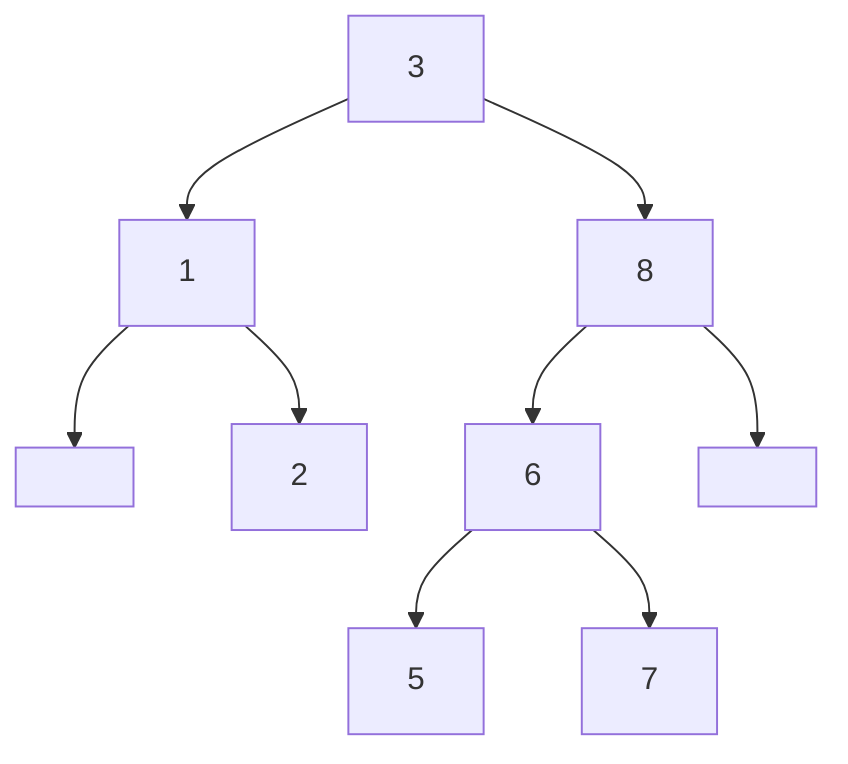
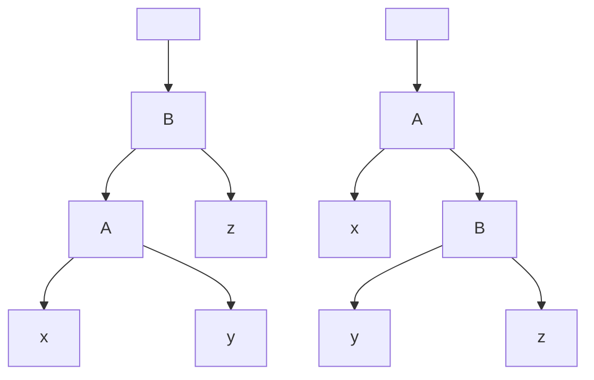

# 第五章 二叉搜索树（Binary Search Tree）

## 5.1 基本概念

### 5.1.1 定义

二叉树是度为 $2$ 的一颗树，其中树中的每个数据项称作一个结点。二叉树通过递归的方法来定义，对于每个结点，都有一个亲结点，一个左子结点和一个右子结点，亲结点，左子结点和右子结点均可空，记作 $Nil$

如果一个结点的亲结点为 $Nil$，称该结点为根结点，一棵树只有唯一一个根结点。如果一个结点的左子树和右子树均为 $Nil$，称该结点为叶结点

左子结点和右子结点分别是左子树和右子树的根结点，其中左子树和右子树都是二叉树

记从根结点到一个叶结点的路径中，最长的路径长度为树的高度 $h$

一颗二叉搜索树是以一颗二叉树来定义的，二叉搜索树中的结点，总是以以下方式来存储：

设 $x$ 是二叉搜索树中的一个结点。如果 $y$ 是 $x$ 的左子树中的结点，则 $y.key\leqslant x.key$；如果 $y$ 是 $x$ 的右子树中的结点，则 $y.key\geqslant x.key$

### 5.1.2 遍历

二叉搜索树的性质决定了二叉搜索树可以通过一个简单的递归方法遍历树中的关键字，这种算法叫做`中序遍历`

`中序遍历`

先遍历左子树的结点，然后输出自己，最后遍历右子树的结点

```c
Inorder-Traversal(x):
    if x != Nil
        Inorder-Traversal(x.left)
        print x.key
        Inorder-Traversal(x.right)
```

`前序遍历`

先输出自己，然后遍历左子树的结点，最后遍历右子树的结点

`后序遍历`

先遍历左子树的结点，然后遍历右子树的结点，最后输出自己

**定理**：如果 $x$ 是一个有 $n$ 个结点的二叉搜索树，那么遍历 $x$ 的运行时间为 $\Theta(n)$

**[中序遍历](./BST.c)**

```c
void inorder_traversal(BST_Node *node) {
    if (node != BST_NIL) {
        inorder_traversal(node->left);
        printf("%d, ", node->key);
        inorder_traversal(node->right);
    }
}
```

### 5.1.3 查询

从树根开始查找，并沿着这棵树的任意一个简单路径向下查找，具体过程如下

```c
Tree-Search(x, k):
    if x == Nil or k == x.key
        return x
    if k < x.key
        Tree-Search(x.left, k)
    if k > x.key
        Tree-Search(x.right, k)
```

该递归可以被改写成更好的迭代形式

```c
Interative-Tree-Search(x, k):
    while x != Nil and k != x.key
        if k < x.key
            x = x.left
        else
            x = x.right
    return x
```

在任意高度为 $h$ 的树上，查询操作沿着一条简单路径进行，因此运行时间是 $O(h)$

**[查询](./BST.c)**

```c
BST_Node *BST_search(BST *tree, DataType searching) {
    BST_Node *patrol = tree->root;
    while (patrol != BST_NIL) {
        if (searching == patrol->key) {
            break;
        } else if (searching < patrol->key) {
            patrol = patrol->left;
        } else {
            patrol = patrol->right;
        }
    }
    return patrol;
}
```

#### 最小关键字元素和最大关键字元素

从根结点开始一直沿着左子树查找，直到遇到一个 $Nil$，此时可以确定最小关键字元素

```c
Tree-Minimum(x):
    while x.left != Nil
        x = x.left
    return x
```

**[最小关键字](./BST.c)**

```c
BST_Node *minimum(BST_Node *tree_root) {
    BST_Node *patrol = tree_root;
    while (patrol->left != BST_NIL) {
        patrol = patrol->left;
    }
    return patrol;
}
```

查找最大关键字元素的方法与最小关键字对称

```c
Tree-Maximum(x):
    while x.right != Nil
        x = x.right
    return x
```

**[最大关键字](./BST.c)**

```c
BST_Node *maximum(BST_Node *tree_root) {
    BST_Node *patrol = tree_root;
    while (patrol->right != BST_NIL) {
        patrol = patrol->right;
    }
    return patrol;
}
```

查找最小关键字和最大关键字的伪代码沿着一条简单路径进行，因此运行时间也是 $O(h)$

#### 后继与前驱

对于一个元素 $x$，如果 $x$ 是二叉搜索树中的最大关键字元素，则 $x$ 的后继为 $Nil$，如果 $x.right$ 非空，则 $x$ 右子树的最小关键字元素为 $x$ 的后继；如果 $x.right$ 为空，且 $x$ 存在后继，那么它一定是 $x$ 及 $x$ 所有子树的结点的祖先，并且 $x$ 是这个祖先的左子树上的结点

```c
Tree-Successor(x):
    if x.right != Nil
        return Tree-Minimum(x.right)
    y = x.p
    while y != Nil and x == y.left
        x = y
        y = y.p
    return y
```

**[后继](./BST.c)**

```c
BST_Node *BST_successor(BST_Node *node) {
    if (node->left != BST_NIL) {
        return minimum(node->right);
    } else {
        BST_Node *patrol = node;
        while (patrol->parent != BST_NIL && patrol == patrol->parent->right) {
            patrol = patrol->parent;
        }
        return patrol->parent;
    }
}
```

寻找前驱的算法与寻找后继对称

```c
Tree-Predecessor(x):
    if x.left != Nil
        return Tree-Maximum(x.left)
    y = x.p
    while y != Nil and x == y.right
        x = y
        y = y.p
    return y
```

**[前驱](./BST.c)**

```c
BST_Node *BST_predecessor(BST_Node *node) {
    if (node->left != BST_NIL) {
        return maximum(node->left);
    } else {
        BST_Node *patrol = node;
        while (patrol->parent != BST_NIL && patrol == patrol->parent->left) {
            patrol = patrol->parent;
        }
        return patrol->parent;
    }
}
```

寻找后继与前驱的伪代码沿着一条向下或向上的简单路径进行，因此运行时间是 $O(h)$

**定理**：在一颗高度为 $h$ 的二叉搜索树上，Search，Maximum，Minimum，Successor，Predecessor 操作的运行时间均为 $O(h)$

### 5.1.4 插入和删除

#### 插入

定义要插入的数值为 $v$，以结点 $z$ 的形式插入，其中 $z.key=v$

1. 如果树为空，则 $z$ 作为树的根结点
2. 如果 $z.key\leqslant x.key$，递归地插入 $x$ 的左子树
3. 如果 $z.key\geqslant x.key$，递归地插入 $x$ 的右子树

```c
Tree-Insert(T, z):
    y = Nil
    x = T.root
    while x != Nil
        y = x
        if z.key <= x.key
            x = x.left
        else
            x = x.right
    z.p = y
    if y == Nil
        T.root = z
    else if z.key <= y.key
        y.left = z
    else
        y.right = z
```

插入的过程沿着一条简单路径进行，运行时间是 $O(h)$

**[插入](./BST.c)**

```c
void BST_insert(BST *tree, DataType key) {
    BST_Node *node = create_node(key);
    if (tree->root == BST_NIL) {
        tree->root = node;
    } else {
        BST_Node *patrol = tree->root;
        BST_Node *patrol_parent;
        while (patrol != BST_NIL) {
            if (key <= patrol->key) {
                patrol_parent = patrol;
                patrol = patrol->left;
            } else {
                patrol_parent = patrol;
                patrol = patrol->right;
            }
        }
        node->parent = patrol_parent;
        if (key <= patrol_parent->key) {
            patrol_parent->left = node;
        } else {
            patrol_parent->right = node;
        }
    }
}
```

#### 删除

首先定义什么是替换，将树中的一个结点 $z$ 替换为结点 $v$ 的操作为

1. 如果 $z$ 是根节点，则 $T.root=v$
2. 如果 $z$ 是 $z.p$ 的左子结点，则 $z.p.left=v$
3. 如果 $z$ 是 $z.p$ 的右子结点，则 $z.p.right=v$

```c
Tree-Transplant(T, z, v):
    if z.p == Nil
        T.root = v
    else if z == z.p.left
        z.p.left = v
    else
        z.p.right = v
    if v != Nil
        v.p = z.p
```

替换的操作仅定义了 $z.p$ 和 $v.p$ 的变化，$v.left$ 和 $v.right$ 的变化由调用 Tree-Transplant 方法的函数来决定

**[替换](./BST.c)**

```c
void replace(BST *tree, BST_Node *replaced, BST_Node *another) {
    if (replaced == tree->root) {
        tree->root = another;
    } else if (replaced == replaced->parent->left) {
        replaced->parent->left = another;
    } else {
        replaced->parent->right = another;
    }
    if (another != BST_NIL) {
        another->parent = replaced->parent;
    }
}
```

从树中删除一个结点 $z$ 有三种情况，其中第三种比较复杂

1. 如果 $z$ 是一个叶结点，则简单地用 $Nil$ 替换 $z$
2. 如果 $z$ 有一个子结点，则简单地用 $z$ 的子结点替换 $z$
3. 如果 $z$ 有两个子结点，则用 $z$ 的后继 $y$ 替换 $z$ 的位置，并且进行一定修改

着重考虑第三种情况

1. 如果 $y$ 是 $z$ 的子结点，则用 $y$ 替换 $z$，并且保留 $z$ 的左子结点作为 $y$ 的左子结点
2. 如果 $y$ 不是 $z$ 的子结点，则先用 $y$ 的右子结点替换 $y$，然后令 $y.right=Nil$，再用 $y$ 替换 $z$，并且保留 $z$ 的左右子结点作为 $y$ 的左右子结点

```c
Tree-Delete(T, z):
    if z.left == Nil
        Tree-Transplant(T, z, z.right)
    else if z.right == Nill
        Tree-Transplant(T, z, z.left)
    else
        y = Tree-Minimum(z)
        if y.p != z
            Tree-Transplant(T, y, y.right)
            Tree-Transplant(T, z, y)
            y.left = z.left
            z.left.p = y
            y.right = z.right
            z.right.p = y
        else
            Transplant(T, z, y)
            y.left = z.left
            z.left.p = y
```

删除中的 Tree-Minimum 操作的运行时间为 $O(h)$，其余操作包括 Tree-Transplant 的运行时间为常数级，因此删除操作的运行时间为 $O(h)$

**定理**：在一颗高度为 $h$ 的二叉搜索树上，对动态集合进行插入和删除操作的运行时间为 $O(h)$

**[删除](./BST.c)**

```c
void BST_delete(BST *tree, BST_Node *deleting) {
    if (deleting != BST_NIL) {
        if (deleting->left == BST_NIL) {
            replace(tree, deleting, deleting->right);
            free(deleting);
        } else if (deleting->right == BST_NIL) {
            replace(tree, deleting, deleting->left);
            free(deleting);
        } else {
            BST_Node *successor = minimum(deleting->right);
            if (successor->parent == deleting) {
                replace(tree, deleting, successor);
                successor->left = deleting->left;
                deleting->left->parent = successor;
                free(deleting);
            } else {
                replace(tree, successor, successor->right);
                replace(tree, deleting, successor);
                successor->left = deleting->left;
                deleting->left->parent = successor;
                successor->right = deleting->right;
                deleting->right->parent = successor;
                free(deleting);
            }
        }
    }
}
```

## 5.2 随机构建二叉搜索树

### 5.2.1 使用二叉搜索树进行排序

首先将一个数组 $A[1...n]$ 顺序插入到一个二叉搜索树中，然后按照中序遍历的方法打印出来，根据二叉搜索树的性质，打印出来的序列将是有序的

$e.g.$

给定数组 $A[1...n]=\{3,1,8,2,6,7,5\}$

构建二叉搜索树



中序遍历打印输出 $<1,2,3,5,6,7,8>$

当该二叉树是一颗完全平衡树时，是最好情况，插入的运行时间为 $\Theta(h)=\Theta(\log n)$，共插入 $n$ 个结点，故整体运行时间为 $\Theta(n\log n)$

当该二叉树完全倒向一边，成为一颗完全不平衡树时，是最差情况，插入的运行时间为 $\Theta(n)$，共插入 $n$ 个结点，故整体运行时间为 $\Theta(n^2)$

二叉搜索树的结果与快速排序完全相同，这是因为它们的算法具有相似的结构，二叉搜索树将第一个元素作为根结点，然后把所有小于它的放到左子树，把所有大于它的扔到右子树，然后递归地将下一个元素作为根节点；而快速排序将第一个元素作为关键元素，把所有小于它的移到左边，把所有大于它的移到右边，然后递归地将下一个元素作为关键元素。

根据这个特点，就可以类似地用随机化的方式来处理二叉搜索树

1. 随机打乱原数组 $A$
2. 使用二叉搜索树排序

随机构建的二叉搜索树排序的运行时间期望与随机化快速排序相同，为 $\Theta(n\log n)$

### 5.2.2 随机二叉搜索树的平均高度

二叉搜索树排序的运行时间是所有结点深度的和，因为每个结点 $x$ 插入时都经过了长度为 $depth(x)$ 的简单路径，因此有

$$T(n)=\sum_{x}depth(x)$$

又因为

$$T(n)=\Theta(n\log n)$$

因此对于该树的任意结点

$$E[\frac{1}{n}\sum_{x}depth(x)] = \frac{\Theta(n\log n)}{n}=\Theta(\log n)$$

这里求出的是结点的深度期望，而树的高度是最大深度

**定理**：一颗随机化的二叉搜索树的平均高度为 $O(\log n)$

`Jensen不等式`

假设存在一个下凸函数 $f$ 和一个随机变量 $X$，则

$$f(E[X])\leqslant E[f(X)]$$

**不等式证明**：对于所有 $x_1,x_2\in \R$，以及任意 $\alpha,\beta\geqslant0$，且满足 $\alpha+\beta=1$，有

$$f(\alpha x_1+\beta x_2)\leqslant\alpha f(x_1)+\beta f(x_2)$$

这样的函数叫做下凸函数

推广：若 $f:\R\to\R$ 是下凸函数，并且有 $x_1,x_2,...,x_n\in\R$，假设有 $n$ 个实数 $\alpha_1,\alpha_2,...,\alpha_n\geqslant0$，且满足 $\sum\alpha_i=1$，则

$$f(\sum_{i=1}^n\alpha_i x_i)\leqslant\sum_{i=1}^n\alpha_i f(x_i)$$

假设存在一个下凸函数 $f$，和随机变量 $X$

$$f(E[X])=f(\sum\Pr(X=x)x)\leqslant\sum\Pr(X=x)f(x)$$

假设存在一个集合 $S=\{x_1,x_2,...\}$ 使得 $f(x_i)=f(x),x_i\in S$

则有

$$\Pr[f(X)=f(x)]=\sum_{x_i\in S}\Pr(X=x_i)$$

$$\Pr[f(X)=f(x)]f(x)=\sum_{x_i\in S}\Pr(X=x_i)f(x)$$

所有的集合 $S$ 的并集为 $x$ 的定义域，因此

$$\sum\Pr(X=x)f(x)=\sum\Pr[f(X)=f(x)]f(x)=E[f(X)]$$

所以

$$f(E[X])\leqslant E[f(X)]$$

**定理证明**：假设 $X_n$ 是一颗随机生成的大小为 $n$ 的二叉搜索树高度的随机变量，并定义指数高度 $Y_n=2^{X_n}$

记 $R_n$ 为根结点在序列中的位置，若 $R_n=i$，则有

$$X_n=1+\max(X_{i-1},X_{n-i})$$

$$Y_n=2\cdot\max(Y_{i-1},Y_{n-i})$$

定义一个指示器随机变量 $Z_{ni}$，满足 $Z_{ni}=1$ 当且仅当 $R_n=i$，其余情况 $Z_{ni}=0$

$$E[Z_{ni}]=\Pr(Z_{ni}=1)=\frac{1}{n}$$

$$Y_n=\sum_{i=1}^n Z_{ni}(2\cdot\max(Y_{i-1},Y_{n-i}))$$

$Y_n$ 的期望为

$$\begin{equation}\begin{split}
E[Y_n]&=E[\sum_{i=1}^n Z_{ni}(2\cdot\max(Y_{i-1},Y_{n-i}))]\\
&=\sum_{i=1}^n E[Z_{ni}(2\cdot\max(Y_{i-1},Y_{n-i}))]\\
&=\sum_{i=1}^n 2E[Z_{ni}]\cdot E[\max(Y_{i-1},Y_{n-i})]\\
&=\frac{2}{n}\sum_{i=1}^n E[\max(Y_{i-1},Y_{n-i})]\\
&\leqslant\frac{2}{n}\sum_{i=1}^n E[Y_{i-1}+Y_{n-i}]\\
&=\frac{2}{n}\sum_{i=1}^n(E[Y_{i-1}]+E[Y_{n-i}])\\
&=\frac{2}{n}\sum_{i=1}^n 2\cdot E[Y_{i}]\\
&=\frac{4}{n}\sum_{i=1}^nE[Y_{i}]
\end{split}\end{equation}$$

假设 $E[Y_n]\leqslant cn^3$

当 $n=1$ 时，$E[Y_1]\leqslant c$ 显然成立

假设当 $n=k,(k\geqslant4)$ 时，$E[Y_k]\leqslant ck^3$ 成立

则当 $n=k+1$ 时

$$\begin{equation}\begin{split}
E[Y_{k+1}]&\leqslant\frac{4}{k+1}\sum_{i=1}^{k+1}E[Y_i]\\
&=\frac{4}{k+1}\sum_{i=1}^{k}E[Y_i]+\frac{4}{k+1}E[Y_{k+1}]\\
&\leqslant\frac{4}{k}\sum_{i=1}^{k}E[Y_i]\\
&\leqslant\frac{4}{k}\sum_{i=1}^{k}ck^3\\
&\leqslant\frac{4}{k}\sum_{i=0}^{k+1}ck^3\\
&\leqslant\frac{4c}{k}\int_{0}^{k} x^3dx\\
&=\frac{4c}{k}\frac{k^4}{4}\\
&=ck^3
\end{split}\end{equation}$$

所以 $E[Y_n]\leqslant cn^3$ 成立

所以

$$2^{E[X_n]}\leqslant E[2^{X_n}]=E[Y_n]\leqslant cn^3$$

所以

$$E[X_n]\leqslant\log cn^3=\log c+3\log n$$

所以

$$E[X_n]=O(\log n)$$

## 5.3 平衡搜索树

### 5.3.1 定义

平衡搜索树是一种搜索树但不一定是二叉树，它动态地改变整棵树的形状，来保证在一颗大小为 $n$ 的树上的动态操作运行时间均为 $O(\log n)$，即树的高度是 $O(\log n)$ 的

有以下几种平衡搜索树

`AVL树` `2-3树` `2-3-4树` `B树` `红黑树` `跳跃表`

### 5.3.2 红黑树

红黑树是一种自平衡的二叉搜索树，在每个结点，除了key，p，left，right以外，还附加一个颜色信息color，也叫做红黑性，红黑性满足以下四个原则：

1. 每个结点，或是红色，或是黑色
2. 根结点和叶结点都是黑色的（规定红黑树的每一个内部结点都有两个子结点，本身子结点缺失的结点用Nil补充，红黑树的叶结点一定是Nil）
3. 所有红色结点的亲结点一定是黑色的，因此无法找到连续的红色结点
4. 从一个结点出发，所有通向其后代叶结点的简单路径，每个路径具有相等的黑色节点数量，记这个数量叫做黑高度（bh），计算黑高度时不考虑结点自身

#### 红黑树的高度

**定理**：一颗大小为 $n$ 的红黑树的高度 $h\leqslant2\log(n+1)$

**证明**：首先将红色结点与它们的亲结点合并起来，因为红色结点的亲结点一定是黑色结点，这样的结果是一颗2-3-4树，并且所有的叶结点深度相等，等于根结点的黑高度

假设原树的高度为 $h$，生成的2-3-4树高度为 $h'$

原树的叶结点数量为 $n+1$

在2-3-4树中，叶结点数量满足 $2^{h'}\leqslant n+1\leqslant 4^{h'}$

得出 $h'\leqslant \log(n+1)$

根据红黑树的性质三，从根结点出发的任意一条简单路径上的红色结点数不会超过黑色节点数，因此可以得出 $h'\geqslant \frac{h}{2}$

综上得出，$h\leqslant 2\log(n+1)$

#### 红黑树的插入与删除

简单地插入会破坏整棵树的红黑性，为了维持它，需要以下几个步骤

1. 插入或删除
2. 更新颜色
3. 重新排列

重新排列的操作叫做旋转



以上从左到右叫做右旋，从右到左叫做左旋，这个操作仍然维持了二叉搜索树的性质

插入操作分为以下三步

1. 用二叉搜索树的插入方法，将对象插入到一个内部结点
2. 将对象着色为红色，这样能保证性质四的维持
3. 通过旋转或重新着色等保持性质三
